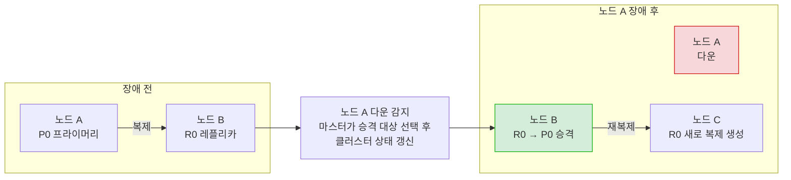
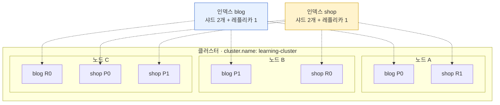
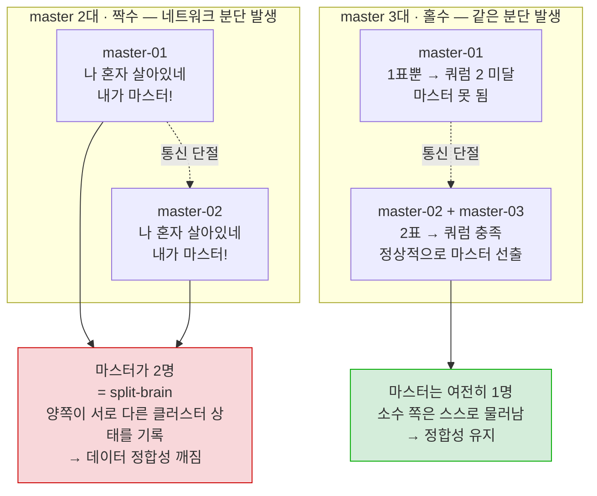
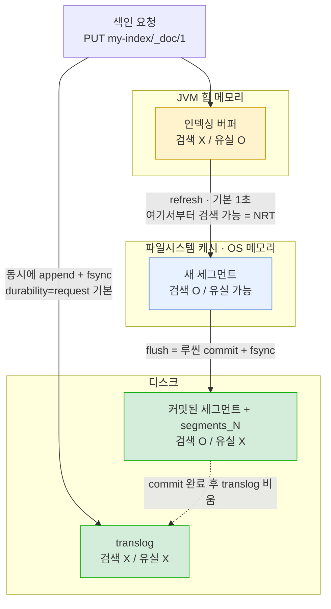
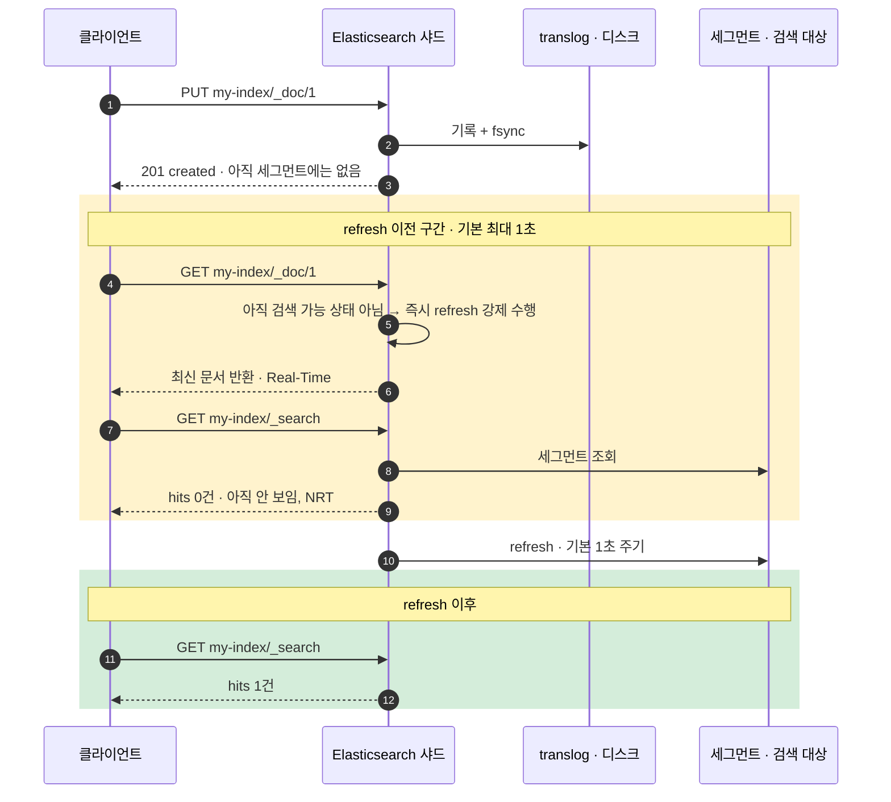

# 1~2장. 엘라스틱서치 소개와 기본 동작 — 스터디 노트


---

## 1. 엘라스틱서치란? (책 1.1)

**정의**: 엘라스틱서치는 아파치 루씬(Apache Lucene)을 기반으로 만든 분산 검색·분석 엔진이다. 데이터를 JSON 문서로 저장하고, HTTP 기반 RESTful API로 색인·검색·집계를 수행한다.

**핵심 특성**

| 특성 | 설명 |
|---|---|
| 분산 아키텍처 | 여러 노드에 걸쳐 데이터를 샤드(shard) 단위로 분산 저장. 수평 확장(scale-out)이 기본 전제 (구조는 2절에서 상세) |
| 역색인(Inverted Index) | 단어 → 문서 목록 매핑 구조. 전통적인 RDB의 순차/B-Tree 인덱스와 달리 풀텍스트 검색에 최적화 (자세한 내용은 바로 아래) |
| 스키마 유연성 | "스키마리스"로 불리지만 정확히는 매핑(mapping)이 존재하며, 명시하지 않으면 동적 매핑으로 타입을 추론함 (3장 3.2절에서 상세) |
| 준실시간(Near Real-Time) | 색인 즉시 검색 가능한 게 아니라 refresh 주기(기본 1초)마다 검색 가능한 상태로 반영됨 (3절 루씬 구조, 4절 CRUD 실습에서 직접 확인) |
| RESTful + JSON | 모든 조작이 HTTP 메서드 + JSON body로 이루어짐 (curl, Dev Tools 등으로 바로 호출 가능). Java 등 언어별 공식 클라이언트 라이브러리(Java API Client 등)도 내부적으로는 이 REST API를 감싼 HTTP 클라이언트임 (아래 보충 참고) |
| 고가용성 | 복제본(replica shard)을 통해 노드 장애 시에도 데이터 유실 없이 서비스 지속 |

> 🔎 **역색인이 실제로 뭘 저장하나**: "문서 → 단어" 대신 "단어 → 문서 목록"을 저장하는 자료구조. 예를 들어 "elasticsearch"라는 단어가 문서 3, 7, 15에 등장한다면 `elasticsearch → [3, 7, 15]` 형태로 저장. 이 덕분에 "특정 단어를 포함한 문서 찾기"가 매우 빠름 (RDB의 순차 스캔과 대비). 실제로는 단순 목록이 아니라 용어 빈도(term frequency), 위치(position) 정보까지 같이 저장해서 스코어링(관련도 계산)에 활용됨. (역색인만으로는 안 되는 "최신순 정렬" 같은 정렬·집계는 doc_values가 담당 — 자세한 내용은 3장 3.2절에서)

> 🔎 **"바이너리 프로토콜이 없다"는 정확히는 클라이언트 이야기**: 지금 우리가 클라이언트로 ES에 접근하는 경로는 HTTP(9200) 하나로 일원화된 게 맞다. 다만 ES가 바이너리 프로토콜을 안 쓰는 건 아니고, **노드 간 내부 통신(9300 포트, transport 레이어)은 여전히 자체 바이너리 프로토콜**을 사용한다 — 샤드 복제, 클러스터 상태 전파, scatter-gather 검색이 전부 이 경로로 오간다. 예전에는 클라이언트도 이 9300 포트에 직접 붙는 `TransportClient`가 있었지만 **7.0에서 deprecated, 8.0에서 완전 제거**되면서 "클라이언트는 HTTP, 노드끼리는 transport"로 역할이 갈렸다. 우리 `docker-compose.yml`에서 9300을 호스트로 노출하지 않은 것도 이 때문 — 클라이언트가 쓸 일이 없는 포트다.

> 🔎 **고가용성이 실제로 동작하는 방식**: 레플리카는 그냥 "복사본을 하나 더 둔다"가 아니라, 프라이머리 샤드가 있는 노드가 죽으면 **레플리카 중 하나가 자동으로 새 프라이머리로 승격(promotion)**되는 방식으로 동작함. 이 과정에서 어떤 레플리카를 새 프라이머리로 승격할지, 그리고 사라진 샤드를 다른 노드에 다시 복제할지를 결정하는 게 바로 마스터 노드의 역할 — 그래서 마스터 자체의 가용성(쿼럼, split-brain 방지)이 먼저 보장돼야 이 승격 과정도 정상 동작함. 레플리카 수가 많을수록 장애 허용력은 올라가지만 색인 시 복제해야 할 대상도 늘어나 쓰기 성능과 저장 공간을 그만큼 더 씀 — 전형적인 트레이드오프. 마스터 쿼럼과 재선출의 구체적인 동작은 2.3절에서 이어서 다룸.



> 위 그림에서 **승격을 결정하는 주체가 마스터 노드**라는 점이 핵심 — 마스터가 정상 동작하지 못하면(쿼럼 미달) 이 승격 자체가 일어나지 못하고 샤드가 unassigned 상태로 남는다.

**Elastic Stack (구 ELK Stack)**

Elasticsearch·Logstash·Kibana·Beats를 묶어 부르는 Elastic 사의 오픈소스 데이터 스택. 예전에는 대표 3개 제품(Elasticsearch, Logstash, Kibana)의 첫 글자를 딴 **ELK Stack**으로 불렸는데, 이후 Beats가 스택에 정식 합류하면서 "ELK"라는 약어로는 전체를 설명할 수 없게 됨 → 특정 제품 조합을 못박는 약어 대신 **Elastic Stack**이라는 통합 브랜드명으로 바뀜 (제품군이 더 늘어나도 이름을 안 바꿔도 되는 이점도 있음). 그래서 오래된 문서·블로그에는 여전히 "ELK Stack"이라는 표현이 많이 남아있음.

- **Elasticsearch**: 저장·검색·분석 엔진 (이 스터디의 대상)
- **Kibana**: 시각화·대시보드·클러스터 관리 UI
- **Logstash**: 데이터 수집·가공·적재 파이프라인 (무겁지만 변환 기능이 강력)
- **Beats**: 경량 데이터 수집 에이전트(Filebeat, Metricbeat 등). 개별 Beats(Filebeat, Metricbeat, ...)를 따로 설치·관리하던 방식에서, 최근에는 하나의 **Elastic Agent** + Fleet으로 중앙 관리하는 방향으로 Elastic이 무게중심을 옮기는 중 — 새로 데이터 수집 파이프라인을 설계한다면 참고할 흐름

> 🔎 **OpenSearch와의 관계**: 2021년 라이선스 전환(Apache 2.0 → Elastic License 2.0 + SSPL 듀얼 라이선스)을 계기로 갈라져 나온 AWS 주도의 포크. 초기엔 API가 거의 동일했지만 시간이 지나며 기능이 조금씩 달라지고 있음.
>
> 실무에서 선택 기준으로 자주 언급되는 것들:
> - **라이선스** (⚠️ 2024년에 상황이 바뀐 부분): OpenSearch는 Apache 2.0. Elasticsearch는 2021년 ELv2 + SSPL로 전환했다가, **2024년 8월 OSI 승인 오픈소스 라이선스인 AGPLv3를 선택지로 추가**(코드 기준 8.16부터 반영)해서 현재는 **AGPLv3 / ELv2 / SSPL 중 골라 쓰는 트라이 라이선스**임. 즉 "Elasticsearch는 더 이상 오픈소스가 아니다"는 설명은 2021~2024년 기준이고 지금은 맞지 않음. 다만 AGPLv3는 카피레프트가 강해서(네트워크 서비스로 제공해도 소스 공개 의무 발생) "관리형 서비스로 재판매" 시나리오에서는 여전히 제약이 있는 셈 — 라이선스만으로 OpenSearch를 골라야 할 이유는 예전보다 확실히 줄어든 상태
> - **클라우드 벤더 종속**: AWS 매니지드 서비스(OpenSearch Service)를 이미 쓰고 있거나 AWS 생태계에 깊이 있다면 OpenSearch가 자연스러운 선택
> - **최신 기능 반영 속도**: 신규 기능(예: ES|QL, 최신 벡터 검색 개선 등)은 보통 Elasticsearch 쪽에 먼저 나오고 OpenSearch가 뒤따라가는 경향 — 최신 기능이 중요하면 Elasticsearch가 유리
> - **기존 생태계/팀 경험**: 플러그인, 클라이언트 라이브러리, 사내 운영 노하우가 어느 쪽에 이미 쌓여 있는지도 실무적으로는 큰 비중을 차지함
> - 우리 팀처럼 이미 Elasticsearch로 구축된 환경이라면, 전환 비용을 감수할 특별한 이유가 없는 한 계속 Elasticsearch를 쓰는 게 일반적인 판단

**주요 활용 사례**

- 풀텍스트 검색 (이커머스 상품 검색, 문서/사내 지식 검색)
- 로그·메트릭 분석 (Observability, 흔히 "로그 적재용 ES"로 접하는 케이스)
- 보안 이벤트 분석 (SIEM)
- 최근 트렌드: 벡터 검색 기반 시맨틱 검색, RAG(Retrieval-Augmented Generation)의 벡터 스토어로 활용 — LLM 응용에서 임베딩 벡터를 저장하고 유사도 검색(kNN)하는 용도로 최근 자주 쓰임. 책은 2023년 기준이라 이 흐름을 깊게 다루지 않지만, `dense_vector` 필드 타입과 kNN 검색이 매핑에서 실제로 어떻게 쓰이는지는 3장 3.2절(필드 타입)에서 구성도와 함께 조금 더 구체적으로 다룸

**RDB와의 비교 감각 잡기**

| | RDB | Elasticsearch |
|---|---|---|
| 강점 | 트랜잭션, 조인, 정합성 | 풀텍스트 검색, 대량 집계, 수평 확장 |
| 조인 | 기본 지원 | 제한적 (nested/parent-child로 흉내만 가능, 3장 이후 범위) |
| 트랜잭션 | ACID 보장 | 문서 단위 원자성만 보장, 다중 문서(multi-document) 트랜잭션 없음 |
| 스키마 변경 | ALTER TABLE | 매핑은 필드 추가는 유연하지만 타입 변경은 사실상 reindex 필요 |

> 🔎 **"다중 문서 트랜잭션 없음"과 "조인 제한적"이 실제로 뭘 뜻하나**
> - **다중 문서 트랜잭션 없음**: RDB는 `BEGIN ~ COMMIT`으로 여러 테이블의 여러 row를 하나의 원자적 단위로 묶어 처리할 수 있지만(전부 성공 또는 전부 롤백), ES는 **문서 하나를 색인/업데이트/삭제하는 단위**까지만 원자성을 보장함. 문서 A와 문서 B를 "둘 다 성공해야 하는 하나의 트랜잭션"으로 묶는 기능 자체가 없음 (bulk API로 여러 문서를 한 번에 보낼 순 있지만, 각 문서는 개별적으로 성공/실패하고 전체가 롤백되지 않음)
> - **조인이 "제한적"인 이유**: RDB 조인처럼 두 개의 독립된 인덱스를 런타임에 자유롭게 엮는 기능은 없음. 대신 두 가지 방식으로 흉내만 냄 — (1) **nested**: 배열 안의 객체들을 부모 문서 내부에 별도 문서처럼 저장해서 배열 요소 단위로 정확한 검색이 가능하게 함(완전히 별개 문서가 아니라 같은 문서 안에 존재), (2) **parent-child**: 부모/자식을 아예 별도 문서로 분리하고 `join` 필드로 연결, `has_child`/`has_parent` 쿼리로 조회(같은 샤드에 저장되도록 라우팅 필요). 둘 다 RDB 조인보다 제약과 비용이 커서 정말 필요할 때만 신중하게 사용 — nested 타입은 3장 3.2절 필드 타입 표에서 다시 등장함

---

## 2. 실습 환경 구축과 클러스터 구조 (책 1.3 + 2장 구조 설명)

### 2.1 로컬 클러스터 띄우기

- 단일 노드 대신 **master 3대 + data 1대** 멀티 노드 구성으로 실습 (`docker-compose.yml` 참고) — 처음부터 클러스터 구조를 눈으로 볼 수 있도록
- 설치 과정 자체는 사전 배포로 대체: `docker compose up -d` 한 번이면 전체 스택이 뜨는 상태로 공유

```bash
docker compose up -d
# 확인
curl -s "http://localhost:9200/_cluster/health?pretty"
```

| 서비스 | 접속 URL | 비고 |
|---|---|---|
| es-master01 (master) | http://localhost:9200 | 기본 진입점 |
| es-master02 (master) | http://localhost:9201 | 마스터 장애 실습용 |
| es-master03 (master) | http://localhost:9202 | |
| es-data01 (data, ingest, remote_cluster_client) | http://localhost:9203 | 실제 샤드가 올라가는 유일한 노드 |
| Kibana | http://localhost:5601 | 내부적으로 `es-data01:9200`에 접속 |
| Cerebro | http://localhost:9000 | |

> 🔎 **master 전용 노드인 9200으로 색인/검색 요청을 보내도 되나**: 된다. 모든 노드는 역할과 무관하게 기본적으로 **coordinating 기능**을 갖고 있어서, master 전용 노드가 요청을 받아도 자기가 처리하지 않고 실제 샤드가 있는 `es-data01`로 넘긴 뒤 결과를 취합해서 돌려준다. 다만 프로덕션에서는 마스터에 이런 부하를 얹는 걸 피하는 게 정석이라 클라이언트는 보통 data 노드나 coordinating 전용 노드를 바라보게 함 — 실습에서는 편의상 9200을 쓰되 "원래는 그렇게 안 한다"는 걸 같이 기억해두면 좋음.

> ⚠️ **이 구성에서는 클러스터 상태가 항상 `yellow`다**: `number_of_replicas` 기본값이 1인데 **data 노드가 1대뿐**이라 레플리카 샤드를 배치할 다른 노드가 없다. ES는 프라이머리와 레플리카를 같은 노드에 두지 않으므로(같은 노드에 두면 복제의 의미가 없음) 레플리카는 `unassigned` 상태로 남고, 그 결과 `_cluster/health`가 `green`이 아니라 `yellow`로 나온다. **고장이 아니라 정상적인 결과**이니 실습 중에 당황하지 말 것. `green`을 보고 싶다면 data 노드를 하나 더 추가하거나, 실습 인덱스를 `number_of_replicas: 0`으로 만들면 된다.
> ```
> PUT my-index
> { "settings": { "number_of_replicas": 0 } }
> ```

> 🔎 **Elasticvue는 왜 `docker-compose.yml`에 없을까**: Elasticvue는 (1) 크롬 확장(Chrome extension), (2) 셀프호스팅용 Docker 이미지(`cars10/elasticvue`) 두 가지 방식을 다 지원함. 우리 환경은 크롬 확장으로 설치해서 쓰는 방식 — 크롬 웹스토어에서 "Elasticvue" 검색해 설치하고, 접속 화면에서 확인할 엔드포인트(예: `http://localhost:9200`)만 등록하면 바로 씀. 별도 컨테이너를 안 띄워도 되니 지금 구성엔 이 방식이 더 간단함. 필요하면 `cars10/elasticvue` 이미지를 서비스로 추가해서 Kibana/Cerebro처럼 URL로 접속하는 방식으로 바꿀 수도 있음.

샘플 데이터 적재는 4절 CRUD 실습에서 직접 색인하면서 다룹니다 (Kibana 제공 샘플 데이터셋 대신 실습용 문서를 직접 만들어봄).

> 🔎 **클러스터 vs 단일 서버 검색엔진**: 지금 4개 노드(마스터 3 + 데이터 1)로 실습하는 이유는 단순히 "여러 대 띄워보기"가 아니라, ES가 처음부터 분산 시스템으로 설계됐기 때문. 단일 노드로 써도 동작은 하지만(`discovery.type=single-node`), 실무 클러스터의 동작 원리를 이해하려면 멀티 노드 환경에서 노드 장애·재선출 같은 걸 직접 겪어보는 게 훨씬 체감이 잘 됨.
>
> 실습해볼 만한 것 — 활성 마스터를 죽여서 재선출 관찰:
> ```bash
> docker stop es-master01
> curl -s "http://localhost:9201/_cat/nodes?v&h=ip,node.role,master,name"
> ```

### 2.2 계층 구조

계층을 볼 때 **논리 구조(데이터를 어떻게 나누는가)**와 **물리 구조(그게 어느 장비에 놓이는가)** 두 축을 분리해서 보는 게 중요하다. 인덱스는 특정 노드에 속하는 개념이 아니라 클러스터 전체에 걸친 논리적 묶음이고, 실제로 노드 위에 배치되는 물리 단위는 **샤드**다.

```
[논리 구조] — 데이터를 어떻게 나누는가
클러스터(Cluster)
 └─ 인덱스(Index)                      ← 노드가 아니라 클러스터에 속함
     └─ 샤드(Shard) = 하나의 독립된 루씬 인덱스
         └─ 세그먼트(Segment)
             └─ 문서(Document)

[물리 구조] — 그게 어디에 놓이는가
클러스터(Cluster)
 └─ 노드(Node)
     └─ 샤드(Shard)                    ← 노드에 배치되는 단위는 인덱스가 아니라 샤드
```

> ⚠️ 흔한 오해: "인덱스가 노드 안에 들어있다"는 그림을 자주 보는데, 정확히는 **하나의 인덱스가 여러 노드에 샤드 단위로 흩어져 있다**. 아래 그림처럼 인덱스 하나가 노드 3대에 걸쳐 있는 게 일반적인 모습이다.



> `P` = 프라이머리 샤드, `R` = 레플리카 샤드. 점선은 "논리적으로 이 인덱스에 속한다"는 관계이고, 실선 박스는 "물리적으로 이 노드에 저장돼 있다"는 뜻. **같은 샤드의 P와 R은 절대 같은 노드에 배치되지 않는다**(예: `blog P0`는 노드 A, `blog R0`는 노드 C) — 같은 노드에 두면 그 노드가 죽었을 때 복제본도 같이 사라져 의미가 없기 때문. 우리 실습 환경에 data 노드가 1대뿐이라 항상 `yellow`인 이유가 바로 이 규칙이다.

- **클러스터**: 같은 `cluster.name`을 가진 노드들의 집합. 하나의 논리적 데이터베이스처럼 동작
- **노드**: ES 프로세스 하나 (우리 환경에서는 컨테이너 하나 = 노드 하나)
- **인덱스**: RDB의 테이블과 유사한 논리적 데이터 묶음
- **샤드**: 인덱스를 나눈 물리적 단위. 각 샤드는 그 자체로 하나의 완전한 루씬 인덱스
- **세그먼트**: 샤드(루씬 인덱스) 내부를 구성하는 불변 저장 단위 (3.3절에서 상세)
- **문서(Document)**: 색인의 최소 단위. RDB의 row에 해당하는 JSON 객체 하나. `_id`(또는 라우팅 값)를 기준으로 특정 샤드 하나에 저장됨
- **레플리카**: 샤드의 복제본. 장애 대응 + 읽기 부하 분산

**타입(Type) — 지금은 없어진 개념 (레거시 문서에서 마주칠 수 있음)**

예전 ES(5.x 이전)는 인덱스 안에 여러 "타입"을 둬서 RDB의 테이블처럼 문서를 논리적으로 구분할 수 있었음 (`인덱스 > 타입 > 문서` 구조, URL도 `PUT my-index/my_type/1`처럼 타입명이 들어감). 하지만 타입이 달라도 내부적으로는 결국 같은 루씬 인덱스에 다 같이 저장돼서 필드 매핑이 충돌하거나 매핑이 걷잡을 수 없이 커지는 문제가 잦았음. 그래서 이 구조는 단계적으로 폐기됨:

- **6.0**: 인덱스당 타입을 1개로 제한
- **7.0**: 사실상 제거 — 내부적으로 `_doc`이라는 단일 타입만 존재 (지금 우리가 쓰는 `PUT my-index/_doc/1`의 `_doc`이 바로 이 흔적)
- **8.0**: API에서 `_type` 파라미터 자체가 완전히 삭제됨

**지금 논리적으로 문서를 구분하고 싶으면 타입이 아니라 별도 인덱스로 분리**하는 게 맞는 방법. 개념 자체는 폐기됐지만, 오래된 클러스터·튜토리얼·Stack Overflow 답변 등에서 여전히 타입이 들어간 예제를 자주 보게 되므로 "이게 뭐지" 싶을 때 레거시 구조라는 걸 알아두면 도움이 됨.

### 2.3 노드 역할과 마스터/데이터 분리

우리 `docker-compose.yml`이 실제 예시입니다.

| 역할 | 설명 |
|---|---|
| `master` | 클러스터 상태(메타데이터) 관리, 노드/샤드 배치 결정. 데이터 저장·검색은 하지 않음 |
| `data` | 샤드 저장, 실제 검색/색인 실행. CPU·디스크 I/O를 가장 많이 씀 |
| `ingest` | 색인 전 파이프라인(전처리) 실행. 보통 data 노드와 겸임 |
| `remote_cluster_client` | 원격 클러스터 검색(CCS)·복제(CCR)에 필요. Kibana의 일부 기능(Stack Monitoring에서 원격 클러스터를 조회하는 경로 등)이 이 역할을 요구하기 때문에, 이 역할이 없는 노드에만 Kibana가 붙어 있으면 해당 기능이 막힐 수 있음 (겪었던 실제 이슈 — 자세한 원인 분석과 대응 전략은 5장에서) |
| 역할 없음(`[]`) | coordinating-only 노드. 사실 모든 노드가 기본적으로 coordinating 기능을 갖고 있어서, "이것만 하는" 노드를 별도로 만들 때만 의미가 있음 |

```yaml
# docker-compose.yml 발췌
es-master01:
  environment:
    - node.roles=master
es-data01:
  environment:
    - node.roles=data,ingest,remote_cluster_client
```

**역할별로 언제, 왜 분리하는가 (일반 기준)**

노드 역할 분리는 정해진 정답이 있는 게 아니라, 부하 성격이 다른 역할을 한 노드에 몰아둘 때 생기는 리스크를 어디까지 감수할지의 문제. 판단 기준을 역할별로 정리하면:

- **master vs data**: master는 클러스터의 "두뇌"(메타데이터 관리, 노드/샤드 배치 결정)라서 응답이 느려지면 불필요한 재선출, 최악의 경우 split-brain으로 이어질 수 있음. data 노드는 검색/색인 부하가 커서 같은 노드가 master까지 겸임하면 그 부하가 master 안정성에 영향을 줌. 그래서 **트래픽 규모와 무관하게 프로덕션에서는 기본적으로 분리**하는 게 정석 — master 전용(가벼운 스펙, 안정성 우선) + data 전용(무거운 스펙, 처리량 우선)
- **ingest**: 색인 전 파이프라인(grok 파싱, enrich, 필드 가공 등)을 실행하는 역할. 파이프라인이 가볍다면(필드 rename/set 정도) data 노드가 겸임해도 부담이 적지만, 정규식 기반 grok 파싱이나 enrich processor처럼 CPU를 많이 쓰는 무거운 파이프라인을 대량 트래픽에 돌린다면 이 부하가 검색·색인 성능을 갉아먹음 → **파이프라인이 무겁고 트래픽이 크다면 분리 고려**
- **remote_cluster_client**: 크로스 클러스터 검색(CCS)·복제(CCR)처럼 다른 클러스터에 나가서 쿼리를 던지는 역할. 모든 노드에 줄 필요는 없고, 보통 소수의 "게이트웨이" 성격 노드(흔히 coordinating-only 노드)에만 부여해서 외부로 나가는 네트워크 연결·보안 경계를 그 노드들로 좁히는 게 일반적 → **여러 클러스터를 넘나드는 트래픽이 있고 보안 경계를 명확히 나누고 싶다면 분리 고려**
- **coordinating-only**: 위 세 역할과 달리 아예 "아무 역할도 없는" 노드를 별도로 두는 패턴. 대규모 클러스터에서 클라이언트 요청을 받아 분산(scatter-gather)만 전담시켜 data 노드의 검색 부하를 줄이는 용도

일반적인 원칙: **노드 수와 트래픽이 작을수록 역할을 묶어서 자원을 아끼고, 특정 역할의 부하가 커지거나(CPU 경합, 네트워크·보안 경계 필요) 장애 영향 범위를 좁혀야 할 때 그 역할부터 순차적으로 분리**한다. 우리 학습 환경(`es-data01` 하나가 `data,ingest,remote_cluster_client`를 겸임)은 규모가 작아 아직 그 정도 부하가 없어서 분리하지 않은 것 — 이 판단 기준 자체가 5장 클러스터 구성 전략과 이어짐.

> 🔎 **마스터가 관리하는 "클러스터 상태(cluster state)"란 정확히 뭘까**: 위 표에서 "클러스터 상태(메타데이터) 관리"라고만 짧게 썼는데, 실제로 여기에 들어가는 정보는 인덱스 매핑·세팅, 어느 샤드가 어느 노드에 있는지를 나타내는 **샤드 라우팅 테이블**, 클러스터에 속한 노드 목록, 인덱스 템플릿, ILM 정책 등 "클러스터를 운영하는 데 필요한 모든 메타데이터"임 (실제 문서 데이터는 포함하지 않음 — 그건 data 노드가 담당). 이 상태는 마스터 노드 하나가 들고 있는 게 아니라 **모든 노드가 사본을 유지**하고, 마스터가 변경 사항이 생길 때마다(인덱스 생성, 샤드 재배치 등) 클러스터 상태를 갱신해서 전체 노드에 전파(publish)함 — 그래서 어떤 노드로 요청을 보내도 "지금 이 인덱스가 어느 샤드에 있는지"를 스스로 알고 요청을 올바른 노드로 라우팅할 수 있는 것. `GET _cluster/state`로 현재 클러스터 상태 전체를 직접 확인해볼 수 있음(실습 환경처럼 작은 클러스터가 아니면 출력이 매우 길어짐에 주의).

**쿼럼(Quorum)과 마스터 후보 수는 왜 홀수인가**

마스터 선출에 필요한 쿼럼 = `(master-eligible 노드 수 / 2) + 1`

| master-eligible 수 | 쿼럼 | 장애 허용 |
|---|---|---|
| 1 | 1 | 0대 |
| 2 | 2 | 0대 (1대짜리와 장애 허용력 동일한데 자원만 2배) |
| 3 | 2 | 1대 |
| 5 | 3 | 2대 |

짝수는 항상 바로 아래 홀수와 장애 허용력이 같아 자원 낭비. 우리 클러스터가 master 3대인 이유가 바로 이것 (학습용 최소 HA 구성).

**왜 쿼럼이 없으면 위험한가 — split-brain 시나리오**



핵심은 "**전체의 과반(쿼럼)을 확보한 쪽만 마스터가 될 수 있다**"는 규칙 덕분에, 분단이 나도 마스터를 가질 수 있는 쪽이 최대 한 곳뿐이라는 것. 2대 구성에서는 각자 1표씩이라 어느 쪽도 과반(2표)을 못 얻어 클러스터가 아예 멈추거나, 규칙을 느슨하게 풀면 양쪽 다 마스터가 되어버린다.

> 이 구성을 실전 운영 전략(스펙, 노드 수 결정, 보안 적용 순서 등)으로 확장하는 내용은 **5장 "서비스 환경에 클러스터 구성"**에서 다룹니다.

> 🔎 **`minimum_master_nodes`는 왜 안 보일까**: 예전(7.0 이전) ES는 `discovery.zen.minimum_master_nodes`를 관리자가 직접 쿼럼 값에 맞춰 설정해야 했고, 이 값을 잘못 잡는 게 split-brain의 흔한 원인이었음. 7.0부터는 Raft에서 영감을 받은 새 클러스터 코디네이션 레이어가 도입돼서, 쿼럼(voting configuration)을 ES가 마스터 후보 노드 수를 보고 **자동으로 계산·관리**함. 이제 관리자가 손댈 설정은 클러스터를 처음 부트스트랩할 때 1회성으로 지정하는 `cluster.initial_master_nodes`뿐. 위 쿼럼 표가 여전히 유효한 이유는, 계산식은 그대로고 "누가 그 계산을 하느냐"만 자동화됐기 때문.

### 2.4 클러스터를 들여다보는 도구: Kibana / Cerebro / Elasticvue

같은 클러스터를 보는 목적이 다른 세 가지 도구를 함께 씁니다.

| | Kibana | Cerebro | Elasticvue |
|---|---|---|---|
| 성격 | Elastic 공식 제품 | 서드파티, cluster-oriented | 서드파티, document-oriented |
| 주 목적 | 데이터 시각화·분석 + 클러스터 관리 전반 | 클러스터 운영·모니터링 (노드 상태, 샤드 배치, 헬스) | 문서를 테이블로 브라우징 (필터·정렬·페이지네이션) |
| 강점 | Discover, Dashboard, Dev Tools, Stack Monitoring/Alerting까지 기능 방대 | 가볍고 빠름, 노드/샤드 분산 상태를 한눈에 | Kibana·Cerebro가 약한 "문서를 표로 보기"에 특화, 브라우저 확장/데스크톱 앱으로 설치 간편 |
| 약점 | 무겁고 진입장벽 있음 | 문서를 테이블로 보는 기능 없음 (REST 호출 위주) | 클러스터 관리 기능은 Kibana/Cerebro보다 얕음 |
| 데이터 저장 | 자체 상태를 `.kibana-*` 인덱스에 저장 | 상태 저장 없음 | 상태 저장 없음 |
| 우리 팀 사용 현황 | 책 실습용으로만 사용 | 데모용 | **실제 운영에서 Kibana 대신 사용 중** |

> 한 줄 정리: Kibana는 "데이터를 보는 창", Cerebro는 "클러스터를 보는 계기판", Elasticvue는 "문서를 표로 보는 뷰어". 멀티노드 클러스터의 노드 role·샤드 분산 확인은 Cerebro, 데이터 탐색·시각화는 Kibana, 문서를 테이블처럼 훑어볼 땐 Elasticvue로 나눠 쓰면 됨.

**왜 Cerebro/Elasticvue 접속창에 `localhost:9200`을 넣으면 안 될까?**

Cerebro/Elasticvue도 하나의 Docker 컨테이너다. 컨테이너 안에서 `localhost`는 **자기 자신**을 가리키므로 `http://es-master01:9200`처럼 **서비스명**으로 접속해야 한다.

- 호스트 PC 브라우저에서 `localhost:9200`이 되는 이유: docker-compose의 포트 매핑(`9200:9200`) 덕분
- 컨테이너 → 컨테이너 통신은 포트 매핑과 무관하고, 같은 Docker 네트워크 안에서 서비스명(=컨테이너명)으로 통신해야 함
- docker-compose가 프로젝트별로 만드는 기본 네트워크에는 Docker 내장 DNS 서버(`127.0.0.11`)가 자동으로 떠서 같은 네트워크의 컨테이너들을 서비스명으로 등록해줌 (`/etc/hosts` 수동 설정이 아니라 Compose가 자동 제공하는 기능)

```bash
# 확인용
docker network ls
docker inspect <container> --format '{{json .NetworkSettings.Networks}}'
```

> 🔎 **`_cat` API로 터미널에서 빠르게 들여다보기**: Cerebro/Elasticvue 없이도 터미널에서 클러스터 상태를 바로 확인할 수 있는 REST 엔드포인트들. 장애 상황에서 도구 켤 시간도 없을 때 특히 유용함.
>
> | 엔드포인트 | 용도 |
> |---|---|
> | `GET _cat/health?v` | 클러스터 전체 상태 (green/yellow/red) 한 줄 요약 |
> | `GET _cat/nodes?v` | 노드 목록, 역할, 마스터 여부, 리소스 사용량 |
> | `GET _cat/indices?v` | 인덱스별 문서 수, 크기, 상태 |
> | `GET _cat/shards?v` | 샤드가 어느 노드에 배치돼 있는지, 초기화/재배치 중인지 |
> | `GET _cat/allocation?v` | 노드별 디스크 사용량·샤드 개수 분포 (핫스팟 확인용) |

---

## 3. 엘라스틱서치 내부 구조와 루씬 (책 2.3)

이 절의 개념들(flush/commit/segment/translog)은 이론으로 끝나지 않고 실무 모니터링·장애 대응에서 바로 쓰임 — "왜 갑자기 디스크가 꽉 찼지", "왜 색인 성능이 뚝 떨어졌지" 같은 질문의 답이 대부분 이 흐름 안에 있음. 구체적인 운영 체크리스트는 3.5절 끝에서 정리함.

**전체 흐름 한눈에 보기**

```
[색인 요청]
     │
     ▼
메모리 버퍼에 기록 + translog에 기록   ← 3.5
     │
     │  refresh (기본 1초 주기)
     ▼
새 세그먼트 생성                        ← 3.3
이 시점부터 검색 가능 (NRT)
     │
     │  flush (translog가 임계치 초과 / 백그라운드 자동 / 수동 호출)  ← 3.1
     ▼
루씬 commit: 세그먼트를 디스크에 fsync   ← 3.2
     +
translog 비움
```

**"지금 이 데이터가 어디에 있는가" 관점으로 다시 보기**

위 흐름을 시간순이 아니라 **저장 위치(메모리 → 파일시스템 캐시 → 디스크)** 기준으로 그리면, 각 단계에서 "검색이 되는가"와 "노드가 죽어도 살아남는가"가 왜 따로 노는지가 분명해진다.



읽는 포인트 세 가지:

- **"검색 가능"과 "안전하게 저장됨"은 다른 시점이다.** refresh를 거치면 검색은 되지만 아직 디스크에 fsync된 건 아니고, translog에 기록되면 안전하지만 검색은 안 된다. 이 둘이 분리돼 있어서 ES가 "매 요청마다 디스크 커밋"이라는 비싼 작업 없이도 내구성을 확보할 수 있는 것.
- **색인 요청이 성공 응답을 받는 시점**은 translog에 fsync가 끝난 시점(`index.translog.durability`가 기본 `request`)이지 세그먼트가 만들어진 시점이 아니다. 그래서 "색인은 성공했는데 검색이 안 되는" 구간이 정상적으로 존재한다.
- **flush는 파일시스템 캐시의 세그먼트를 디스크로 확정 짓고 translog를 비우는 작업**이다. translog가 비워지는 건 "이제 이 기록들은 세그먼트로 안전하게 남았으니 재생할 필요가 없다"는 뜻.

### 3.1 루씬 flush
루씬(디스크) 레벨에서 커밋을 수행해 데이터를 영속화하고 translog를 비우는 동작. ES의 `flush` API는 이 루씬 커밋 + translog 클리어를 함께 수행한다.

```
flush 실행 시점
translog: [기록1][기록2][기록3] ──┐
                                   ├─▶ 루씬 commit (fsync로 영속화)
메모리 속 세그먼트들 ──────────────┘
                                   └─▶ translog 비움 (새로 다시 쌓기 시작)
```

flush는 다음 조건에서 자동으로 일어나며, 필요하면 수동으로도 호출할 수 있다:

- translog 크기가 `index.translog.flush_threshold_size`를 넘을 때 — **8.x 기본값은 10GB**
- ES가 백그라운드에서 알아서 수행할 때 (translog가 커지면 복구가 느려지므로 ES가 주기적으로 flush를 밀어냄. 추가로 translog 총량은 **디스크 용량의 1%**를 넘지 않도록 제한됨)
- `POST my-index/_flush`로 직접 호출할 때 (공식 문서 표현으로 "rarely needed" — 실무에서 수동 호출할 일은 거의 없음)

> ⚠️ **책/블로그의 "512MB, 30분"은 옛날 기준**: 한국어 자료에 "translog 512MB 초과 또는 마지막 flush 후 30분 경과"라는 조건이 널리 퍼져 있는데, 둘 다 현행 8.x 기준으로는 맞지 않는다.
> - **512MB** → `index.translog.flush_threshold_size`의 **7.x까지의 기본값**. 큰 노드가 인덱싱 버퍼를 다 못 쓰는 문제 때문에 상향돼서 **8.x에서는 기본 10GB**다.
> - **30분** → 아주 예전 버전에 있던 `index.translog.flush_threshold_period` 설정의 잔재. 현행 8.19 공식 문서의 translog 설정 목록에는 `sync_interval`(5s), `durability`(request), `flush_threshold_size`(10GB) 세 가지뿐이고 시간 기반 조건은 없다.
>
> 발표 때는 "정확한 숫자를 외우기보다 **translog가 너무 커지지 않게 ES가 알아서 flush한다**는 구조를 이해하는 게 핵심"이라고 짚고 넘어가는 게 좋다 — 이 숫자들은 버전마다 실제로 바뀌어 왔다.

### 3.2 루씬 commit
메모리에 있던 세그먼트를 디스크에 fsync하여 영속화하는 지점. 커밋 이후의 데이터는 노드가 죽어도 남아있음.

```
커밋 전: 세그먼트가 파일시스템 캐시(메모리)에만 존재 → 프로세스/노드 장애 시 유실 가능
         │
         ▼  fsync
커밋 시점: segments_N 파일 하나에 "현재 유효한 세그먼트 목록"을 원자적으로 기록
         │
         ▼
커밋 후: segments_N에 등록되지 않은 세그먼트는 존재해도 무시됨 (all-or-nothing)
```

`segments_N` 파일 자체가 원자적으로 교체되기 때문에, 커밋 도중 장애가 나도 "일부만 커밋된" 상태가 생기지 않는다 — 직전 commit 아니면 이번 commit, 둘 중 하나만 유효하다.

### 3.3 세그먼트 (Segment)
루씬 인덱스는 여러 개의 **불변(immutable) 세그먼트**로 구성된다. 문서를 업데이트/삭제해도 기존 세그먼트를 직접 수정하지 않고, 삭제는 "삭제 표시(tombstone)"만 남기고 업데이트는 "새 문서 추가 + 기존 문서 삭제 표시"로 처리한다. 세그먼트가 계속 쌓이면 검색 성능이 떨어지므로 주기적으로 **세그먼트 병합(merge)**이 일어난다 (6장에서 수동 병합 다룸).

```
seg_1[문서A, 문서B]   seg_2[문서C, tombstone:A]   seg_3[문서D]
          └───────────────────┬───────────────────┘
                            merge
                              ▼
                    seg_4[문서B, 문서C, 문서D]
        (tombstone 표시됐던 문서A는 병합 과정에서 실제로 제거됨)
```

> 🔎 **세그먼트가 계속 쌓이면 생기는 문제, 그리고 병합**: 색인이 잦을수록 작은 세그먼트가 계속 생기고, 검색 시 모든 세그먼트를 훑어야 하므로 세그먼트가 많아질수록 검색이 느려짐. 백그라운드에서 자동으로 작은 세그먼트들을 큰 세그먼트로 병합(merge)하는데, 이 과정에서 디스크 I/O·CPU를 상당히 씀 — 대량 색인 직후 클러스터가 느려지는 흔한 원인 중 하나.

### 3.4 루씬 인덱스와 엘라스틱서치 인덱스
- **루씬 인덱스** = 샤드 하나. 완전히 독립적으로 동작하는 검색 단위
- **엘라스틱서치 인덱스** = 여러 개의 샤드(=루씬 인덱스)를 논리적으로 묶은 상위 개념
- 검색 요청이 오면 ES가 인덱스에 속한 모든 샤드(루씬 인덱스)에 요청을 흩뿌리고(scatter) 결과를 모아서(gather) 반환

```
              GET my-index/_search  (샤드 2개 구성 예시)
                       │
              ┌────────┴────────┐
              ▼                 ▼
        샤드1 = 루씬 인덱스     샤드2 = 루씬 인덱스
        (+ 레플리카)            (+ 레플리카)
              │                 │
              └────────┬────────┘
                        ▼
              결과 취합(gather) → 클라이언트 응답
```

### 3.5 translog
루씬의 커밋은 비용이 커서 매 요청마다 수행하지 않는다. 대신 색인 요청이 오면 먼저 **translog(트랜잭션 로그)**에 기록해서 내구성(durability)을 확보하고, 실제 루씬 커밋은 주기적으로(또는 flush 시점에) 수행한다. 노드 장애 시 마지막 커밋 이후의 translog를 재생(replay)해서 데이터 유실을 방지한다.

샤드 복구(recovery) 단계에서 바로 이 translog가 쓰인다. 샤드가 재시작되거나 다른 노드로 재할당될 때, ES는 먼저 마지막 commit 시점의 세그먼트를 읽어 그 상태를 복원한 뒤, translog에 남아있는 — 즉 기록은 성공했지만 아직 루씬 commit에는 반영되지 못한 — 작업들을 순서대로 재생(replay)해서 최신 상태로 맞춘다. translog가 크면 클수록 재생해야 할 작업이 많아져 복구 시간이 길어지므로, translog 크기를 적절히 유지하는 것이 복구 속도에 직결된다. flush가 백그라운드에서 주기적으로 수행되며 translog를 비워주는 이유도 여기에 있다.

```
샤드 복구 순서
1. 마지막 commit의 segments_N 로드 → 그 시점까지의 세그먼트 상태 복원
2. translog에 남은 이후 기록을 순서대로 재생(replay)
3. 재생 완료 → 유실 없이 최신 상태로 샤드 기동

   translog가 크다 → 2번 재생량이 많다 → 복구 시간 길어짐
   → flush로 translog를 작게 유지하는 게 복구 속도에도 중요한 이유
```

**색인 요청 하나가 실제로 거치는 흐름(요약)**
```
색인 요청 → (메모리 버퍼에 기록 + translog에 기록)
  → refresh(기본 1초 주기): 메모리 버퍼 → 새 세그먼트 생성, 이때부터 검색 가능(NRT)
  → flush(주기적 또는 조건 충족 시): 세그먼트를 디스크에 fsync(commit) + translog 비움
```

> 이 흐름의 동시성 제어, 체크포인트, 샤드 복구 과정까지 더 깊은 내부 동작은 **8장 "엘라스틱서치의 내부 동작 상세"**에서 다룹니다. 여기서는 "색인해도 왜 바로 검색이 안 되는지", "왜 장애가 나도 데이터가 잘 안 없어지는지"를 이해하는 수준으로 충분합니다.

> 🔎 **실무 운영 관점 체크리스트**: 이 절 개념들이 실제로 부딪히는 상황들
> - **translog 급증 → 디스크 부족**: flush가 밀리거나 노드 장애로 flush가 오래 안 되면 translog가 계속 쌓여 디스크를 압박함. `GET _cat/nodes?v&h=name,du,dt`로 디스크 여유를 주기적으로 확인
> - **refresh_interval을 낮게 잡으면 세그먼트 폭증**: refresh가 잦을수록 작은 세그먼트가 계속 생겨 검색 성능·병합 부하가 늘어남 — 실시간성이 꼭 필요한 게 아니면 refresh_interval을 늘리는 걸 우선 고려 (3장 3.1절)
> - **대량 색인 시 임시로 refresh 끄기**: 초기 대량 적재(bulk load) 때는 `refresh_interval: -1`로 꺼뒀다가 적재 완료 후 다시 켜는 패턴이 표준 — 세그먼트 생성 횟수 자체를 줄여 부하를 낮춤
> - **forcemerge는 신중하게**: 세그먼트를 강제로 병합하는 `_forcemerge` API는 디스크 I/O·CPU를 크게 씀 — 트래픽이 몰리는 시간대는 피하고, 더 이상 쓰기가 없는 "읽기 전용"에 가까운 인덱스(예: 지난 날짜의 로그 인덱스)에만 사용하는 게 안전
> - **`GET _nodes/stats/indices`**: indexing/refresh/flush/merge 각 단계별 소요 시간·횟수를 노드 단위로 확인 가능 — 어느 단계에서 병목이 생기는지 진단할 때 시작점

---

## 4. CRUD 실습 (책 2.1)

Kibana Dev Tools(`http://localhost:5601` → Management → Dev Tools) 또는 curl로 실행 가능. 아래는 Dev Tools 문법 기준. 아래 4.1~4.5는 모두 같은 예시 문서(책 정보 하나)를 색인 → 조회 → 수정 → 검색 → 삭제하는 하나의 흐름으로 이어집니다.

### 4.1 문서 색인
```
PUT my-index/_doc/1
{
  "title": "엘라스틱서치 바이블",
  "author": "여동현",
  "published": "2023-06-29"
}
```

응답:
```
{
  "_index": "my-index",
  "_id": "1",
  "_version": 1,
  "result": "created",
  "_shards": { "total": 2, "successful": 1, "failed": 0 },
  "_seq_no": 0,
  "_primary_term": 1
}
```
- `_doc/1`처럼 ID를 직접 지정하거나, `POST my-index/_doc`으로 ID를 자동 생성할 수 있음 (자동 생성 ID는 20자 길이의 URL-safe Base64 문자열)
- 인덱스가 없으면 이 요청 시점에 **동적으로 자동 생성**됨 (동적 매핑 적용, 3장 3.2절에서 상세)
- `result`는 `created`(신규) 또는 `updated`(같은 `_id`로 재색인) — PUT은 존재 여부와 무관하게 항상 "덮어쓰기"로 동작하므로, 같은 요청을 한 번 더 보내면 `result: updated`가 됨
- `_shards.successful`은 이 색인 요청이 실제로 성공적으로 반영된 샤드 복제본 수(프라이머리 + 레플리카). 기본적으로 프라이머리만 성공해도 요청 자체는 성공 응답을 주지만, 레플리카까지 몇 개나 반영됐는지는 이 값으로 확인 가능
- `_seq_no`/`_primary_term`은 이 문서 버전의 "좌표" — 값 자체는 몰라도 되지만, 뒤에 나올 낙관적 동시성 제어(optimistic concurrency control)에서 그대로 사용됨

### 4.2 문서 조회
```
GET my-index/_doc/1
```

응답:
```
{
  "_index": "my-index",
  "_id": "1",
  "_version": 1,
  "found": true,
  "_source": {
    "title": "엘라스틱서치 바이블",
    "author": "여동현",
    "published": "2023-06-29"
  }
}
```
- 존재하지 않는 문서 조회 시 `found: false`와 함께 404 반환
- `_version`은 이 문서가 몇 번 색인/업데이트됐는지를 나타내는 카운터 — PUT/업데이트 때마다 1씩 증가

> 🔎 **Get API는 왜 "준실시간(NRT)"이 아니라 실시간(Real-Time)일까**: 1절 핵심특성 표의 "준실시간(NRT)" 설명은 정확히는 **검색(Search API)**에만 해당함. `GET my-index/_doc/1`처럼 `_id`로 문서 하나를 직접 조회하는 Get API는 다르게 동작함 — 요청한 문서가 아직 refresh 전이라 검색 가능한 세그먼트에 반영되지 않았다면, ES가 내부적으로 **그 순간 즉시 refresh를 강제로 한 번 수행**해서라도 최신 값을 반환함. 즉 방금 색인한 문서를 바로 `GET .../_doc/1`로 조회하면 항상 최신 값이 나오지만, 같은 문서를 `_search`의 쿼리로 찾으면 refresh 주기(기본 1초) 전까지는 안 걸릴 수 있음 — 4.4절 실습에서 이 차이를 직접 체감할 수 있음. (강제 refresh 비용이 부담스러운 상황이라면 `GET my-index/_doc/1?realtime=false`로 이 동작을 끄고 일반 검색과 같은 NRT 방식으로 조회할 수 있음)

### 4.3 문서 업데이트
```
POST my-index/_update/1
{
  "doc": { "published": "2023-07-01" }
}
```

응답:
```
{
  "_index": "my-index",
  "_id": "1",
  "_version": 2,
  "result": "updated",
  "_shards": { "total": 2, "successful": 1, "failed": 0 },
  "_seq_no": 1,
  "_primary_term": 1
}
```
- 내부적으로는 기존 문서를 통째로 지우고 새로 색인하는 방식(루씬 세그먼트가 불변(immutable)이기 때문 — 3.3절 참고). `doc`에 넣은 필드만 지정해도 되는 이유는, ES가 기존 `_source`를 읽어와 넘겨준 필드만 덮어쓴 다음 전체를 다시 색인해주기 때문 — "부분 업데이트"처럼 보이지만 실제로는 매번 전체 재색인임
- 스크립트 기반 부분 업데이트(`script` 사용)도 가능 — 예: `{ "script": { "source": "ctx._source.published = params.date", "params": { "date": "2023-07-01" } } }`. 조회 없이 필드를 증감시키거나 조건부로 값을 바꿀 때 유용
- `_version`이 2로, `_seq_no`가 1로 올라간 것에 주목 — 매 변경마다 증가하는 이 값들이 **낙관적 동시성 제어(optimistic concurrency control)**의 핵심 재료

> 🔎 **동시에 같은 문서를 수정하면 어떻게 될까**: 두 클라이언트가 같은 문서를 동시에 읽고 각자 수정해서 보내면, 나중에 도착한 요청이 먼저 도착한 요청의 변경을 덮어써버리는 "lost update" 문제가 생길 수 있음. ES는 락(lock) 대신 **버전 비교** 방식으로 이를 막음 — 업데이트 요청에 `if_seq_no`/`if_primary_term`을 같이 보내면, 그 값이 현재 문서의 값과 일치할 때만 요청이 성공하고, 그 사이 다른 요청이 먼저 반영돼서 값이 달라졌다면 `409 Conflict`를 반환함:
> ```
> POST my-index/_update/1?if_seq_no=1&if_primary_term=1
> { "doc": { "published": "2023-07-02" } }
> ```
> 클라이언트는 이 충돌을 받으면 문서를 다시 읽어 최신 `_seq_no`/`_primary_term`을 얻은 뒤 재시도하는 식으로 처리함. (예전 ES(7.0 이전)에서는 `_version` 값 자체로 같은 역할을 했는데, 지금은 `_seq_no`+`_primary_term` 조합이 더 정확한 방식으로 자리잡음 — `_version`은 하위 호환을 위해 여전히 응답에 남아있음)

### 4.4 문서 검색
```
GET my-index/_search
{
  "query": { "match": { "title": "엘라스틱서치" } }
}
```

응답:
```
{
  "took": 2,
  "timed_out": false,
  "_shards": { "total": 1, "successful": 1, "skipped": 0, "failed": 0 },
  "hits": {
    "total": { "value": 1, "relation": "eq" },
    "max_score": 0.6931471,
    "hits": [
      {
        "_index": "my-index",
        "_id": "1",
        "_score": 0.6931471,
        "_source": { "title": "엘라스틱서치 바이블", "author": "여동현", "published": "2023-07-02" }
      }
    ]
  }
}
```
- `took`은 검색에 걸린 시간(ms), `timed_out`은 `timeout` 파라미터로 지정한 제한 시간을 넘겨서 일부 샤드 결과가 빠졌는지 여부
- `hits.total.value`가 실제 매칭된 문서 수, `relation`이 `eq`면 정확한 값, `gte`면 "이 값 이상"이라는 뜻(대량 검색 시 성능을 위해 정확한 카운트를 생략하는 `track_total_hits` 옵션과 관련)
- `hits.hits[]`의 각 항목이 실제 문서(기본 상위 10개, `size`로 조절) — `_score`가 이 문서의 관련도 점수로, 검색 결과는 기본적으로 `_score` 내림차순 정렬됨
- 상세 쿼리 DSL은 4장 범위지만, 여기서는 "색인한 게 검색되는지" 확인 수준으로만 다룸

> 🔎 **스코어링 감(BM25) 살짝 맛보기**
>
> ES 검색 결과의 `_score`는 기본적으로 **BM25** 알고리즘으로 계산됨.
>
> 핵심 아이디어만 꼽으면:
> - 검색어가 문서에 자주 나올수록 점수 ↑ (TF, Term Frequency)
> - 그 단어가 전체 문서 집합에서 희귀할수록 점수 ↑ (IDF, Inverse Document Frequency)
> - 문서 길이가 짧을수록 상대적으로 점수 ↑ (길이 정규화)
>
> 상세 계산식과 매칭 과정은 8장에서 다룸.

### 4.5 문서 삭제
```
DELETE my-index/_doc/1
```

응답:
```
{
  "_index": "my-index",
  "_id": "1",
  "_version": 3,
  "result": "deleted",
  "_shards": { "total": 2, "successful": 1, "failed": 0 },
  "_seq_no": 2,
  "_primary_term": 1
}
```
- 삭제해도 `_version`은 계속 증가함(3으로) — 루씬 세그먼트가 불변이라 실제로는 "삭제 표시(tombstone)"를 새로 기록하는 것과 같은 원리(3.3절 참고). 같은 `_id`로 다시 색인하면 이 버전 다음 번호부터 이어짐
- 존재하지 않는 문서를 삭제하면 `result: not_found`와 함께 404 반환
- 쿼리 조건에 맞는 문서를 한 번에 여러 개 지우고 싶다면 `_id`를 하나씩 지정하는 대신 `POST my-index/_delete_by_query`에 쿼리를 넣어 일괄 삭제 가능 (내부적으로는 scroll + bulk delete로 동작하며, 대량 삭제 시 세그먼트 병합 부하가 커질 수 있어 트래픽이 적은 시간대에 실행하는 게 안전)

**실습 포인트**: 색인 직후 바로 `_search`를 호출하면 결과가 안 나올 수 있음 — refresh_interval(기본 1초) 때문. 반면 같은 시점에 `GET my-index/_doc/1`로 조회하면 항상 최신 값이 나옴(위 4.2절 Get API 실시간성 참고). 이 현상은 앞서 본 3절의 translog/flush 개념, 3장 3.1절의 refresh_interval 설정과 바로 연결됨.

**라이브 데모에서 이 차이를 보여주는 시퀀스**



> 💡 **데모 팁**: 실제로는 refresh가 1초 만에 끝나서 사람이 손으로 재현하기 어렵다. 확실히 보여주려면 실습 인덱스를 `refresh_interval: "30s"`(또는 `-1`)로 만들어두고 시연한 뒤, `POST my-index/_refresh`를 수동 호출해서 그 순간 검색 결과가 나타나는 걸 보여주는 게 가장 극적이다.
> ```
> PUT demo-index
> { "settings": { "number_of_replicas": 0, "refresh_interval": "-1" } }
>
> PUT demo-index/_doc/1
> { "title": "엘라스틱서치 바이블" }
>
> GET demo-index/_doc/1        # 바로 나옴 (Real-Time)
> GET demo-index/_search       # hits 0건
> POST demo-index/_refresh     # 수동 refresh
> GET demo-index/_search       # 이제 hits 1건
> ```
> ⚠️ 단, 이 트릭은 `refresh_interval`을 **명시적으로 지정**하기 때문에 3장 3.1절에서 다루는 `index.search.idle.after`(검색이 뜸하면 refresh를 건너뛰는 최적화)가 적용되지 않는다 — 오히려 데모 목적에는 그게 더 예측 가능해서 좋다.

---

## 참고 링크
- [Elastic 공식 - What is Elasticsearch](https://www.elastic.co/what-is/elasticsearch)
- [Elastic License FAQ](https://www.elastic.co/pricing/faq/licensing)
- [Elasticsearch is open source, again (Simon Willison 요약)](https://simonwillison.net/2024/Aug/29/elasticsearch-is-open-source-again/)
- [Elastic 공식 - Near real-time search](https://www.elastic.co/guide/en/elasticsearch/reference/current/near-real-time.html)
- [Elastic 공식 - Translog 설정 (8.19)](https://www.elastic.co/guide/en/elasticsearch/reference/8.19/index-modules-translog.html) — flush 조건·기본값 확인용
- [Elastic 공식 블로그 - Elasticsearch Is Open Source. Again!](https://www.elastic.co/blog/elasticsearch-is-open-source-again) — 2024년 AGPLv3 추가
- [Apache Lucene - Segments 개념](https://lucene.apache.org/core/)

---

다음: [3장. 인덱스 설계](./study-ch3.md)
