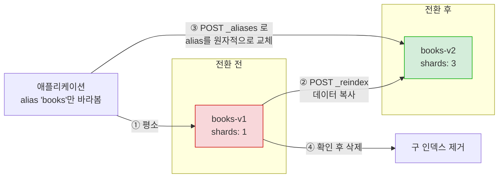
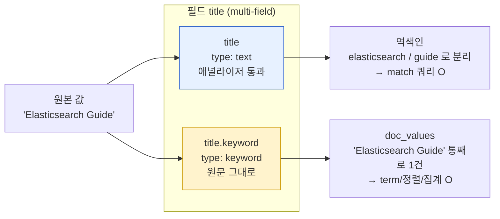
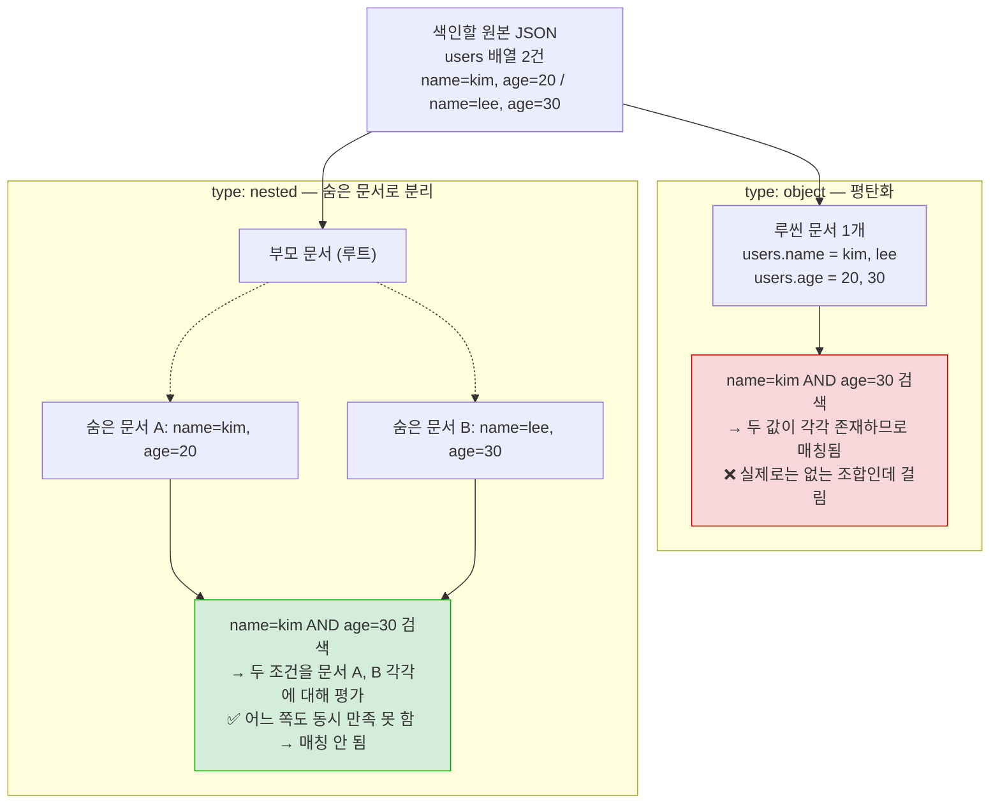
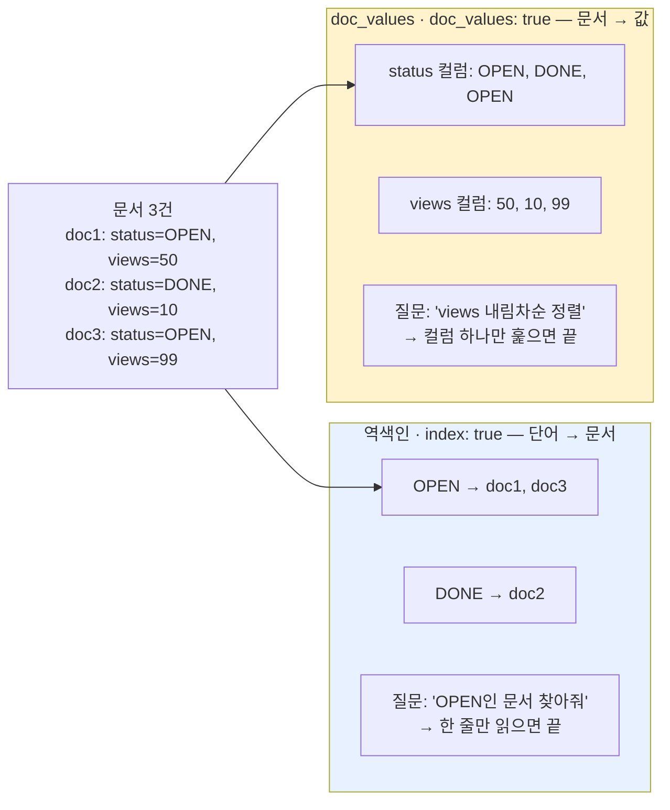
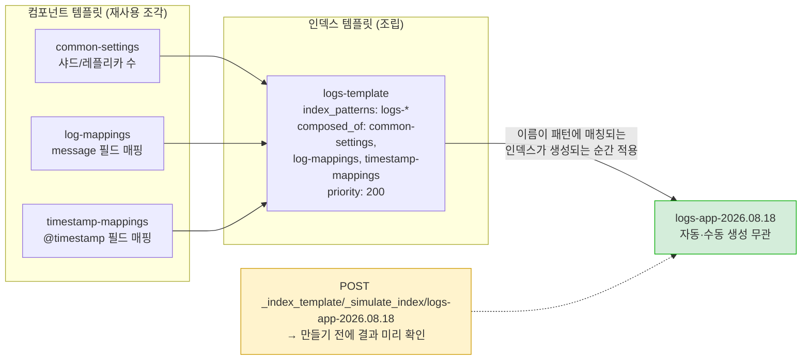
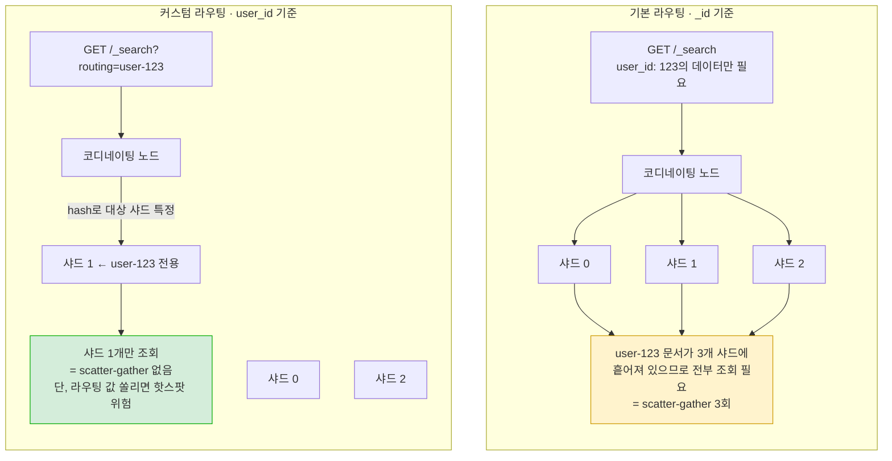

# 3장. 인덱스 설계

---

## 3.1 인덱스 설정

### number_of_shards
- 인덱스를 나눌 프라이머리 샤드 개수. **기본값 1** (ES 7 이전엔 5였다가 7.0부터 1로 변경됨)
- **인덱스 생성 후에는 변경 불가** — 샤드는 라우팅 해시 계산에 관여하기 때문에 나중에 늘리거나 줄이려면 `_split`/`_shrink`(6장) 또는 reindex가 필요
- 너무 적으면 확장성이 떨어지고, 너무 많으면 오버헤드(샤드당 메타데이터·파일 핸들 등)가 커짐 → 사전 설계가 중요한 이유

> 🔎 **설정을 "바꿀 수 없을 때"의 현실적 대응 — reindex**: number_of_shards처럼 생성 후 변경 불가능한 설정을 바꿔야 하는 상황이 실무에서 반드시 옴. 이때는 새 설정으로 인덱스를 새로 만들고 `_reindex` API로 데이터를 옮긴 뒤, alias를 새 인덱스로 스위칭하는 패턴을 씀 (무중단 전환의 기본 패턴). 자세한 절차는 6장 "reindex", "alias" 절에서.



> 핵심은 **애플리케이션이 처음부터 실제 인덱스명이 아니라 alias를 바라보게 해두는 것**. 그래야 3단계에서 코드 배포나 재시작 없이 인덱스를 갈아끼울 수 있다. alias 교체는 하나의 `_aliases` 요청 안에서 remove + add를 함께 보내면 원자적으로 처리되어 "어느 인덱스도 안 보이는" 순간이 생기지 않는다. **인덱스를 처음 만들 때부터 alias를 씌워두는 습관**이 나중에 이 전환을 가능하게 만든다.

> 🔎 **샤드 수를 늘리는 게 "공짜"가 아닌 이유**: 샤드 하나 = 루씬 인덱스 하나. 즉 `number_of_shards`를 늘리면 그만큼 독립적인 루씬 인덱스가 노드 위에 더 생기는 것이고, 여기에 `number_of_replicas`만큼 복제본 샤드까지 곱해져서 실제 루씬 인덱스 개수는 `number_of_shards × (number_of_replicas + 1)`이 된다. 예를 들어 샤드 5개 + 레플리카 1개면 루씬 인덱스가 10개 떠 있는 셈. 이 숫자가 늘어날수록 아래와 같은 비용이 함께 늘어난다.
>
> **샤드가 너무 많을 때**
> - 샤드마다 파일 핸들, 메모리(각 샤드가 갖는 세그먼트 메타데이터, 캐시 등), 클러스터 상태(cluster state)에 등록되는 메타데이터가 늘어남 → 힙 사용량이 커지고 GC 부담 증가
> - 마스터 노드는 클러스터 상태(모든 인덱스·샤드의 배치 정보)를 관리하는데, 샤드 수가 많아지면 이 상태를 갱신·전파하는 비용이 커져서 **클러스터 전체의 반응성**이 떨어짐 (샤드 수가 극단적으로 많은 클러스터에서 매핑 변경 하나가 클러스터 전체를 느리게 만드는 사고가 실제로 발생함)
> - 검색 요청은 관련된 모든 샤드에 흩뿌려지므로(scatter-gather), 샤드가 너무 잘게 쪼개져 있으면 오히려 오버헤드(요청 수, 취합 비용)가 커져서 **색인·검색 성능이 함께 떨어질 수 있음**
>
> **샤드가 너무 적을 때(=하나가 너무 클 때)**
> - 샤드 하나의 크기가 비대해지면 검색 시 그 샤드를 스캔하는 데 걸리는 시간이 길어짐
> - 노드 장애 후 복구(recovery)는 샤드 단위로 이뤄지기 때문에, 샤드가 크면 클수록 복구해야 할 데이터량도 커져서 **복구 시간이 길어짐** (그동안 해당 샤드는 노란색/빨간색 상태로 남아 가용성이 떨어진 채로 버텨야 함)
> - 수평 확장의 최소 단위가 샤드이므로, 샤드 수 자체가 적으면 노드를 아무리 추가해도 그 샤드들을 다 분산시킬 수 없어 확장성이 막힘
>
> 결국 "샤드를 늘릴수록 좋다"도 "적을수록 좋다"도 아니고, 위 두 방향의 비용이 만나는 지점(샤드당 10~50GB 권장 구간)을 찾는 문제다.

### 적절한 값은 어떻게 정하나 (실무 가이드)
- **목표 샤드 크기**: Elastic 공식 가이드 기준 **샤드 하나당 10~50GB**, 문서 수는 **최대 2억(200M) 개**를 넘지 않는 선을 권장. ILM으로 롤오버할 때도 흔히 50GB를 트리거 기준으로 잡음
  - 너무 작은 샤드: 샤드마다 붙는 메타데이터·힙 사용량·네트워크 오버헤드가 누적되어 낭비가 큼 (특히 샤드 수가 많아지면 마스터의 클러스터 상태 갱신 비용도 커짐)
  - 너무 큰 샤드: 검색 시 샤드 하나를 스캔하는 시간이 길어지고, 노드 장애 후 복구(recovery)도 샤드 단위로 이뤄지기 때문에 복구 시간이 늘어남
- **계산 접근법**: `number_of_shards ≈ 예상 총 데이터 크기 ÷ 목표 샤드 크기(10~50GB)`. 여기에 향후 데이터 증가분을 여유 있게 감안 (샤드 수는 나중에 못 늘리므로 보수적으로 넉넉히 잡는 게 원칙)
- **참고**: 과거엔 "노드 힙 1GB당 샤드 20개 이하"라는 경험칙이 있었지만, 7.x~8.x에 걸친 내부 최적화로 **8.3부터 공식적으로 폐기**됨. 지금은 노드당 샤드 수를 **1,000개 이하**로 유지하는 것과 샤드 크기(10~50GB)를 지키는 것, 이 두 가지가 더 단순하고 최신인 기준
- 결론적으로 "일단 1개로 만들고 나중에 필요하면 늘리자"가 안 통하는 설정이라, 예상 데이터량 + 성장 속도를 먼저 가늠하고 시작하는 게 실무에서 사고를 줄이는 방법

### number_of_replicas
- 프라이머리 샤드의 복제본 개수. **기본값 1**
- 이 값은 **런타임에 자유롭게 변경 가능** (샤드 개수와 달리 유연함)
- 읽기 처리량 분산 + 장애 시 데이터 보존 역할

> 🔎 **레플리카 수의 트레이드오프**: 레플리카는 "공짜 보험"이 아니라 명확한 비용을 동반한다.
> - **늘릴 때 이점**: (1) 프라이머리가 있는 노드가 죽어도 레플리카가 승격돼 데이터 유실 없이 서비스 지속, (2) 검색 요청은 프라이머리/레플리카 아무 샤드에서나 처리 가능해서 레플리카가 많을수록 **읽기 처리량(검색 동시 처리량)이 늘어남**
> - **늘릴 때 비용**: (1) 디스크 사용량이 `(레플리카 수 + 1)`배로 증가, (2) 색인(쓰기) 요청은 프라이머리에 쓴 뒤 모든 레플리카에도 복제해야 완료되므로, 레플리카가 많을수록 **쓰기 지연(latency)과 클러스터 전체 쓰기 부하가 늘어남** — 읽기는 빨라지지만 쓰기는 오히려 느려지는 트레이드오프
> - **0으로 두면**: 디스크·쓰기 비용은 최소지만 노드 하나만 죽어도 데이터 유실 위험 — 개발/테스트 환경이 아니면 프로덕션에서는 권장하지 않음
> - 실무 기준: 읽기 위주 서비스면 레플리카를 늘려 검색 처리량을 확보하고, 쓰기가 잦고 읽기 여유가 있다면 레플리카를 최소화하는 식으로 워크로드 성격에 맞춰 조정. 샤드 수와 달리 런타임에 바꿀 수 있으므로 처음엔 보수적으로 시작해서 트래픽을 보며 조정하는 것도 가능

### refresh_interval
- 새로 색인된 문서가 검색 가능한 상태로 반영되는 주기. **기본값 1초**
- `-1`로 설정하면 자동 refresh를 끔 (대량 색인 시 임시로 꺼서 성능을 높이는 패턴에 사용, 색인 완료 후 다시 켬)
- 2장에서 본 "색인 직후 검색이 안 되는" 현상이 바로 이 설정 때문

> 🔎 **`index.search.idle.after` — 검색이 뜸한 샤드는 refresh 자체를 건너뛴다**: `refresh_interval`이 "몇 초마다 refresh할지"를 정하는 설정이라면, `index.search.idle.after`(기본 **30초**)는 "그 주기적 refresh를 아예 안 할 수도 있는" 조건을 추가하는 설정이다. 어떤 샤드에 **`index.search.idle.after`에 지정한 시간(기본 30초) 동안 검색 요청이 한 번도 안 들어오면**, 그 샤드는 "유휴(idle)" 상태로 간주돼 정기적인 refresh를 더 이상 수행하지 않는다(색인은 계속돼도 검색 요청이 없으니 굳이 검색 가능 상태로 만들 필요가 없다는 논리). 이후 그 샤드에 **검색 요청이 다시 들어오면, 그 요청이 트리거가 되어 즉시 refresh를 한 번 수행**한 뒤 결과를 반환한다 — 그래서 오랫동안 조회가 없던 인덱스에 갑자기 검색을 하면 첫 번째 요청만 살짝 느려질 수 있음. 데이터는 계속 들어오지만 검색은 가끔만 하는 인덱스(예: 배치로 색인하고 하루에 몇 번만 조회하는 로그성 인덱스)에서 불필요한 refresh 비용(작은 세그먼트 양산, CPU)을 줄여주는 최적화 장치.
>
> ⚠️ **가장 중요한 단서 조항**: 이 search idle 동작은 **`index.refresh_interval`을 명시적으로 지정하지 않은 인덱스에만 적용된다.** `refresh_interval`을 직접 설정해두면(`"1s"`처럼 기본값과 같은 값으로 설정하더라도) 검색 유무와 무관하게 항상 그 주기대로 refresh가 돌아간다. 즉 "refresh_interval 기본 1초"라는 설명은 엄밀히는 "**검색 트래픽이 있는 샤드에 한해** 1초"이고, 아무 설정도 안 한 인덱스에 30초 넘게 검색이 없으면 refresh 자체가 멈춰 있다.
>
> 실무에서 이게 드러나는 흔한 증상: 새벽/주말처럼 조회가 없던 인덱스에 아침 첫 검색을 날렸을 때 유독 느린 현상(누적된 문서를 refresh하느라). 지연에 민감한 인덱스라면 `refresh_interval`을 명시적으로 지정해서 이 최적화가 개입하지 않게 만드는 것이 대응책이다.

### 인덱스 설정을 지정하여 인덱스 생성
```
PUT my-index
{
  "settings": {
    "number_of_shards": 3,
    "number_of_replicas": 1,
    "refresh_interval": "5s"
  }
}
```

> 🔎 **인덱스 자동 생성(auto-create index)은 왜 운영환경에서 피해야 하나**: 위처럼 `PUT my-index`로 설정을 미리 지정하지 않아도, 존재하지 않는 인덱스에 그냥 문서를 색인(`PUT my-index/_doc/1`)하면 ES가 **그 시점에 인덱스를 자동으로 만들어준다** (`action.auto_create_index` 설정이 기본적으로 켜져 있음). 개발 중 빠르게 테스트할 땐 편리하지만, 실제 운영환경에서는 문제가 되는 경우가 많다.
> - 이렇게 만들어진 인덱스는 **모든 설정이 클러스터 기본값**으로 굳어진다 — 특히 `number_of_shards`처럼 생성 후 변경이 불가능한 값이 우리가 계산한 값이 아니라 기본값(1)으로 박혀버림. 나중에 "샤드를 3개로 했어야 했는데 기본값 1로 만들어졌다"는 걸 뒤늦게 발견하면 `_reindex`로 다시 만드는 수밖에 없음
> - 매핑도 동적 매핑에 맡겨지므로, 필드 타입이 의도와 다르게 추론되거나(정수인데 실수로 인식 등) 매핑 폭발(아래 참고) 위험에 그대로 노출됨
> - 오타로 인덱스명을 잘못 입력해도 에러 없이 새 인덱스가 조용히 만들어지기 때문에, "데이터가 안 보인다"는 장애를 오타로 인한 신규 인덱스 생성 때문에 겪는 경우도 흔함
> - 실무 대응: 인덱스 템플릿(3.4절)으로 패턴에 맞는 인덱스가 생성될 때 항상 원하는 설정이 적용되도록 강제하거나, `action.auto_create_index`를 `false`/특정 패턴으로 제한해서 의도치 않은 인덱스 생성 자체를 막는 방식을 씀

---

## 3.2 매핑과 필드 타입

### 동적 매핑 vs 명시적 매핑
- **동적 매핑**: 매핑을 지정하지 않고 문서를 색인하면 ES가 값을 보고 타입을 추론해서 자동으로 매핑을 만듦 (문자열 → `text` + `keyword` 서브필드, 숫자 → `long`/`double`, 날짜 형식 문자열 → `date` 등)
  - 판단 기준은 JSON 값 자체의 **타입과 형태**를 순서대로 검사하는 방식이다. 값이 JSON 숫자면 정수 형태(`42`)인지 소수 형태(`3.14`)인지를 보고 각각 `long`/`double`로 매핑하고(더 작은 정수/실수 타입으로 최적화하지 않고 일단 가장 큰 타입으로 잡음 — 그래서 명시적 매핑이 권장되는 이유 중 하나), 값이 JSON 문자열이면 먼저 **날짜 포맷과 일치하는지**(`date_detection`, 기본 켜짐 — `yyyy-MM-dd` 같은 흔한 ISO 형식들을 순서대로 시도)를 검사해서 맞으면 `date`로 매핑한다. 날짜로도 안 잡히고 숫자처럼 생긴 문자열(`"42"`)이면 `numeric_detection`(기본 꺼짐)이 켜져 있을 때만 숫자 타입으로 매핑하고, 꺼져 있으면 그냥 문자열로 취급한다. 최종적으로 문자열로 판정되면 **항상 `text` + `keyword` 서브필드 조합**으로 매핑됨 — 풀텍스트 검색과 정확 일치·정렬을 둘 다 대비해두는 ES의 기본 전략
  - 이 추론 순서 자체가 실무에서 사고로 이어지는 지점이다: 상품 코드처럼 숫자로만 이뤄진 문자열(`"00123"`)을 그대로 색인하면 `text`/`keyword`로 잡혀서 의도한 숫자 비교(`gte`/`lte`)를 못 하게 되고, 반대로 우편번호처럼 앞자리 0이 의미 있는 값을 실수로 숫자로 잡히게 두면 `"00123"` → `123`으로 앞자리 0이 날아가 버림 — 이런 문제들이 바로 아래 "실무에서는 명시적 매핑을 권장"하는 이유의 구체적인 사례
- **명시적 매핑**: 인덱스 생성 시 필드 타입을 직접 지정. 실무에서는 명시적 매핑을 강력히 권장 — 동적 매핑에 맡기면 의도와 다른 타입으로 잡히거나(예: 정수인데 실수로 감지), 필드가 계속 늘어나는 "매핑 폭발" 문제로 이어질 수 있음

> 🔎 **매핑 폭발(Mapping Explosion) 문제**: 동적 매핑을 켜둔 채로 필드명이 계속 달라지는 데이터(예: 키가 유동적인 JSON, 사용자 정의 속성)를 무분별하게 색인하면 필드 개수가 걷잡을 수 없이 늘어남. ES는 기본적으로 인덱스당 필드 수 제한(`index.mapping.total_fields.limit`, 기본 1000)을 두고 있고, 이 한계에 부딪히면 색인이 실패하기 시작함. 예방책: 명시적 매핑, `dynamic: false`/`strict`로 동적 필드 생성 자체를 제한, 혹은 `enabled: false`로 특정 구간을 통째로 blob 처리.

```
PUT my-index
{
  "mappings": {
    "properties": {
      "title":     { "type": "text" },
      "author":    { "type": "keyword" },
      "published": { "type": "date" },
      "views":     { "type": "long" }
    }
  }
}
```

### 필드 타입 (주요 카테고리)
| 카테고리 | 대표 타입 |
|---|---|
| 텍스트 | `text`(분석됨, 풀텍스트 검색용), `keyword`(분석 안 됨, 정확 일치·정렬·집계용) |
| 숫자 | `long`, `integer`, `short`, `byte`, `double`, `float`, `half_float`, `scaled_float` |
| 날짜 | `date` |
| 불리언 | `boolean` |
| 배열 | 별도 타입 없음 — 아래 "배열" 항목 참고 |
| 객체 | `object`(중첩 JSON), `nested`(배열 내 객체들을 독립 문서처럼 취급) |
| 지리 | `geo_point`, `geo_shape` |
| 기타 | `ip`, `completion`(자동완성), `binary`, `range` 계열(`integer_range` 등) |
| 벡터 | `dense_vector` (벡터 검색/kNN용) |

#### 텍스트: text vs keyword, 언제 무엇을 쓰나
- **`text`**: 색인 시 애널라이저(3.3절)를 거쳐 여러 토큰으로 쪼개져 저장됨. "문장 안에 이 단어가 포함돼 있는가"를 찾는 풀텍스트 검색(`match` 쿼리)에 씀. 토큰화되기 때문에 원문 그대로의 정렬·정확 일치에는 쓸 수 없음(정렬하려면 fielddata가 필요한데 비용 문제로 비권장 — 아래 fielddata 항목 참고)
- **`keyword`**: 애널라이저를 거치지 않고(옵션인 normalizer만 적용 가능) 원문 그대로 하나의 토큰으로 저장됨. "정확히 이 값과 일치하는가"를 찾는 `term` 쿼리, 정렬, 집계(예: 카테고리별 개수 세기)에 씀
  - **왜 정렬/집계에는 `text`가 아니라 `keyword`를 쓰나**: 정렬·집계는 "문서 하나당 값 하나"가 명확해야 의미가 있는데, `text`는 애널라이저를 거쳐 한 필드가 여러 토큰으로 쪼개지기 때문에 "이 문서의 정렬 기준값이 뭔지"가 애매해진다("Elasticsearch Guide"라는 제목이 `["elasticsearch", "guide"]` 두 토큰이 되면 어느 토큰으로 정렬해야 할지 알 수 없음). `keyword`는 원문 전체를 쪼개지 않고 하나의 값으로 저장하므로 doc_values(아래 참고)에 문서당 값 하나가 그대로 들어가고, 그 값 그대로 정렬·집계할 수 있다. `text` 필드를 굳이 정렬/집계하려면 fielddata를 켜야 하는데, 이는 메모리 비용이 크고 위험해서(아래 fielddata 항목 참고) 실무에서는 `keyword` 서브필드(multi-field)를 두는 쪽을 사실상 표준으로 쓴다.
- **선택 기준**: 사용자가 자유 텍스트로 검색어를 입력하고 그 안의 단어를 찾아야 하면 `text`, 코드값·태그·상태값처럼 정확히 일치해야 하거나 정렬/집계 대상이면 `keyword`
- **실무 패턴 — multi-field**: 하나의 필드에 "풀텍스트 검색"과 "정확 일치/정렬/집계"가 둘 다 필요한 경우가 흔함(예: 상품명으로 검색도 하고, 상품명 기준 정렬도 하고 싶을 때). 이때는 `fields`로 같은 값을 두 가지 타입으로 동시에 색인함 — 인덱스 생성 시 명시적으로 지정하는 매핑 예시:
```
PUT my-index
{
  "mappings": {
    "properties": {
      "title": {
        "type": "text",
        "fields": {
          "keyword": { "type": "keyword", "ignore_above": 256 }
        }
      }
    }
  }
}
```



**같은 값이 두 벌로 색인된다**는 게 핵심 — 저장 공간을 두 배 가까이 쓰는 대신 검색과 정렬·집계를 모두 얻는 구조다. 검색은 `title`(text)로, 정렬/집계는 `title.keyword`로 사용. `ignore_above`는 너무 긴 값(기본 예시 256자 초과)은 keyword 서브필드에 색인하지 않도록 막는 안전장치(정렬·집계 인덱스가 불필요하게 커지는 걸 방지)

> 🔎 **`"keyword"`가 두 번 나와서 헷갈릴 수 있는데, 서로 다른 것을 가리킨다**: 위 예시에서 `"fields": { "keyword": {...} }`의 **`keyword`는 서브필드의 이름(key)**이고, 그 안의 `"type": "keyword"`의 **`keyword`는 필드 타입(type)의 이름**이다. 즉 "`keyword`라는 이름을 가진, `keyword` 타입의 서브필드"를 만든 것 — 이름과 타입 이름이 우연히 똑같은 문자열이라 같은 걸로 착각하기 쉽지만 별개의 개념이다. 서브필드 이름은 사실 뭘로 지어도 상관없다(`"raw"`, `"exact"` 등도 흔히 쓰임). 다만 `keyword`라는 이름을 관습적으로 많이 쓰는 이유는, 이 서브필드가 `keyword` **타입**이라는 걸 필드 경로만 보고도(`title.keyword`) 바로 알 수 있게 하려는 네이밍 컨벤션일 뿐이다 — 실제로 Kibana가 인덱스 패턴을 자동 인식할 때도 `.keyword`로 끝나는 서브필드를 관례적으로 찾는 경우가 많아서, 이 컨벤션을 따르는 게 여러 도구와의 호환성 면에서도 유리하다.

#### 숫자: 왜 long/double만 쓰면 안 되나
- **정수 계열**(`byte` 1바이트, `short` 2바이트, `integer` 4바이트, `long` 8바이트): 표현 가능한 값의 범위가 다르고, 바이트 수가 곧 저장 공간이다. 나이·상태코드처럼 범위가 뻔한 값에 굳이 `long`을 쓰면 doc_values·저장 공간을 불필요하게 낭비하게 됨 — **실제 값의 범위에 맞는 가장 작은 타입을 고르는 게 원칙**
- **실수 계열**(`half_float` 2바이트, `float` 4바이트, `double` 8바이트): 바이트 수가 클수록 정밀도가 높지만 저장 공간도 커짐. 대부분의 실무 값(평점, 비율 등)은 `float`로 충분하고, `double`은 정말 높은 정밀도가 필요할 때만
- **`scaled_float`**: 내부적으로는 `long`으로 저장하면서 지정한 배율(scaling factor)로 나눠서 실수처럼 보여주는 타입. 예를 들어 원화 가격처럼 "소수점 둘째 자리까지만 필요한 값"이라면 `scaling_factor: 100`으로 설정해서 정수로 저장 — `double`보다 압축 효율이 좋고 부동소수점 오차도 없음
- 데이터가 크지 않은 학습/테스트 단계에서는 체감이 안 되지만, 수억 건 규모에서는 타입 선택 하나가 전체 인덱스 크기·메모리 사용량에 꽤 큰 차이를 만듦

#### 날짜(date): 저장 방식과 검색
- **저장 방식**: 사람이 입력하는 `"2023-06-29"` 같은 날짜 문자열은 색인 시점에 파싱되어 내부적으로는 **UTC 기준 epoch millis(1970-01-01부터 경과한 밀리초, 64비트 정수)** 로 저장된다. 즉 실질적으로는 `long` 타입과 같은 방식으로 저장·정렬·doc_values 처리됨 — 그래서 날짜 정렬이나 range 필터가 숫자 필드만큼 빠름
- **포맷 지정**: 여러 형식 의 문자열을 허용하려면 `format` 옵션에 `||`로 구분해서 여러 포맷을 나열할 수 있음
  - **그렇다, 실제로 혼용해서 쓸 수 있다.** ES는 이 필드에 값이 색인될 때마다 `||`로 나열된 포맷들을 **왼쪽부터 순서대로 하나씩 시도**해서, 값이 그 형식과 맞으면 그 포맷으로 파싱하고 다음 문서로 넘어간다. 즉 같은 인덱스, 같은 필드에 문서마다 다른 포맷의 날짜값이 섞여 들어와도(예: 어떤 문서는 `"2023-06-29"`, 다른 문서는 epoch millis 숫자 `1687996800000`) 모두 정상적으로 파싱되어 저장된다 — 저장 자체는 항상 앞서 설명한 대로 내부적으로 UTC epoch millis 하나로 통일되므로, 검색·정렬·비교 시에는 원래 어떤 포맷으로 들어왔는지는 신경 쓸 필요가 없다
  - 실무에서 유용한 경우: 여러 소스 시스템에서 서로 다른 날짜 포맷으로 데이터를 보내오는 파이프라인(예: 레거시 시스템은 `yyyy-MM-dd`, 신규 시스템은 epoch millis)을 하나의 인덱스로 통합할 때, 소스별로 전처리해서 포맷을 맞추는 대신 매핑에서 두 포맷을 한꺼번에 허용해버리는 방식으로 대응 가능
  - 주의: 나열된 포맷 중 **하나도 매치되지 않는 값**이 들어오면 해당 문서는 매핑 예외(mapping exception)로 색인 자체가 실패함 — "혹시 모르니 포맷을 왕창 나열해두자"보다는, 실제로 들어올 수 있는 포맷만 정확히 나열하는 게 예상치 못한 형식의 데이터가 조용히 들어오는 걸 막는 데 도움이 됨
```
"published": { "type": "date", "format": "yyyy-MM-dd||epoch_millis" }
```
- **검색**: 정확 일치보다는 구간 검색(`range` 쿼리의 `gte`/`lte`/`gt`/`lt`)이 훨씬 흔한 패턴 — "최근 7일", "이번 분기" 같은 날짜 범위 필터. 정렬은 다른 숫자 타입처럼 doc_values를 그대로 활용

#### 불리언(boolean)
- `true`/`false` 두 값만 가지는 필드. `term` 쿼리로 정확히 필터링하고, 집계하면 버킷이 최대 2개(`true`/`false`)로 나뉨
- JSON의 실제 boolean 값(`true`)뿐 아니라 문자열 `"true"`/`"false"`도 파싱해서 받아들임 — 소스 시스템이 문자열로 boolean을 보내는 경우가 흔해서 실무에서 유용한 관용성

**구체적인 예시로 보기**: `in_stock`(재고 여부)이라는 `boolean` 필드가 있다고 하면,
```
PUT my-index/_doc/1
{ "product": "노트북", "in_stock": true }

PUT my-index/_doc/2
{ "product": "마우스", "in_stock": "false" }
```
문서 2처럼 JSON 문자열 `"false"`로 보내도 ES가 이를 실제 boolean 값 `false`로 파싱해서 저장한다 — 두 문서 모두 같은 방식으로 검색·집계된다. 검색과 집계는 이렇게 동작함:
```
# term 쿼리로 정확히 필터링 — 재고 있는 상품만
GET my-index/_search
{ "query": { "term": { "in_stock": true } } }

# 집계 — 재고 있음/없음 개수를 각각 세기 (버킷 최대 2개)
GET my-index/_search
{
  "size": 0,
  "aggs": { "stock_status": { "terms": { "field": "in_stock" } } }
}
```
집계 응답은 `{"key": true, "doc_count": 1}`, `{"key": false, "doc_count": 1}`처럼 `true`/`false` 두 버킷으로만 나뉜다 — 예를 들어 "재고 있는 상품이 전체의 몇 %인가" 같은 대시보드 지표를 만들 때 흔히 쓰는 패턴. 왜 이 관용성이 실무에서 유용하냐면, CSV → JSON 변환 파이프라인이나 일부 레거시 소스 시스템은 boolean을 진짜 JSON boolean이 아니라 문자열(`"true"`/`"false"`)로 내보내는 경우가 흔한데, 매핑에서 별도 전처리 없이도 그대로 받아들여지기 때문이다.

#### 배열
- ES에는 별도의 "array 타입"이 존재하지 않는다 — **어떤 필드든 값을 배열로 보내면 자동으로 다중값 필드가 된다.** 매핑 선언은 항상 단일 값 기준으로 하고(예: `"tags": { "type": "keyword" }`), 실제 색인할 때 `"tags": ["es", "lucene", "study"]`처럼 배열을 그냥 보내면 됨 — 매핑을 배열용으로 따로 바꿀 필요 없음
- 배열 안의 모든 값은 같은 타입이어야 함
- **주의**: 스칼라 값(문자열/숫자) 배열은 문제없지만, **객체(object) 배열**은 각 객체 간 연관관계가 사라지는 함정이 있음 — 바로 아래 object vs nested에서 다룸

#### 객체(object) vs 중첩(nested) — 상세 비교
JSON 자체는 중첩 구조를 자유롭게 표현할 수 있지만, 그 아래에서 동작하는 루씬은 원래 "플랫(flat)한 필드-값 쌍"만 다룰 수 있는 구조다. `object`와 `nested`는 이 중첩 구조를 루씬 위에 표현하는 서로 다른 두 가지 전략이다.

- **`object`**: JSON의 중첩 구조를 그대로 받아들이지만, 내부적으로는 이를 **평탄화(flatten)**해서 저장한다. 문제는 배열 안에 객체가 여러 개 들어있을 때 생긴다.
  - 예시: `"users": [{"name": "kim", "age": 20}, {"name": "lee", "age": 30}]`를 `object`로 저장하면, 루씬 내부적으로는 `users.name: ["kim", "lee"]`, `users.age: [20, 30]`처럼 **각 필드가 독립된 배열로 평탄화**되어, "이름과 나이가 원래 어느 객체에 같이 있었는지"라는 연관관계가 사라진다
  - 그 결과 `"name이 kim이면서 age가 30인 사람을 찾아줘"` 같은 쿼리를 날리면, 실제로는 그런 사람이 없는데도(kim은 20살, lee가 30살) **두 조건이 각각 배열 안에 존재한다는 이유로 매칭되어버리는 오검색**이 발생함
  - 반대로 객체가 배열이 아니라 단일 객체 하나뿐이라면(`"address": {"city": "seoul", "zip": "12345"}`) 이 문제가 생기지 않음 — 문제는 "배열 안에 여러 객체"인 경우에 한정됨
- **`nested`**: 배열 안 객체 하나하나를 내부적으로 **숨겨진 별도의 루씬 문서**로 저장해서 객체별 필드 연관관계를 그대로 유지한다. 조회할 때는 반드시 `nested` 쿼리로 감싸야 하고, 이 쿼리는 숨겨진 문서 각각에 대해 조건을 평가하기 때문에 위와 같은 오검색이 발생하지 않음
  - 비용: 객체 하나하나가 실질적으로 별도 문서로 취급되므로 내부 문서 수가 늘어나고, `nested` 쿼리는 이 숨겨진 문서들을 조인하듯 다시 부모 문서와 연결하는 과정을 거치므로 `object`보다 색인·검색 비용이 더 든다
  - 매핑 예시:
```
"users": {
  "type": "nested",
  "properties": {
    "name": { "type": "keyword" },
    "age": { "type": "integer" }
  }
}
```



> 이 그림에서 읽어야 할 한 줄: **`object`는 "값들이 존재하는가"만 보고, `nested`는 "같은 원소 안에서 함께 존재하는가"까지 본다.** `nested`가 비싼 이유도 그림에 그대로 드러난다 — 문서 하나를 색인했는데 내부적으로는 루씬 문서가 3개(부모 1 + 숨은 문서 2) 만들어지고, 배열 원소가 하나만 바뀌어도 부모까지 통째로 다시 색인된다.

- **선택 기준**: 배열 안 객체 각각의 필드 조합을 정확히 구분해서 검색해야 한다면 `nested`, 그런 정확한 조합 검색이 필요 없거나 애초에 배열이 아닌 단일 객체라면 기본값인 `object`로 충분. `nested`는 비용이 명확히 크기 때문에 "혹시 몰라서" 미리 쓰기보다는, 위와 같은 오검색 문제를 실제로 겪을 상황인지 먼저 판단하고 적용하는 게 좋음 — RDB 조인 흉내(1~2장에서 언급)로 쓰이는 것도 이 `nested`/parent-child 방식

> 🔎 **`nested`가 "조인처럼 동작한다"는 게 정확히 무슨 뜻인가 — 예제로 보기**
>
> RDB라면 이런 문제를 테이블 두 개로 분리하고 조인으로 풀었을 것이다. 예를 들어 "주문(orders) 테이블"과 "주문 상품(order_items) 테이블"을 별도로 두고 `orders.id = order_items.order_id`로 조인해서 "특정 상품을 5개 이상 주문한 건"을 찾는 식. `nested`는 이걸 **하나의 문서 안에서 흉내낸다** — 배열 안 객체 하나하나를 부모 문서와는 별개인, 하지만 **숨겨서 함께 저장되는 "루씬 문서"** 로 취급해서, 마치 미니 조인 테이블처럼 동작하게 만든다.
>
> 매핑과 데이터:
> ```
> PUT my-orders
> {
>   "mappings": {
>     "properties": {
>       "order_id": { "type": "keyword" },
>       "items": {
>         "type": "nested",
>         "properties": {
>           "product": { "type": "keyword" },
>           "qty":     { "type": "integer" }
>         }
>       }
>     }
>   }
> }
>
> PUT my-orders/_doc/1
> {
>   "order_id": "A-100",
>   "items": [
>     { "product": "keyboard", "qty": 2 },
>     { "product": "mouse",    "qty": 10 }
>   ]
> }
> ```
> 검색 — "mouse를 5개 이상 주문한 주문 건" (조인 없이 하나의 nested 쿼리로 해결):
> ```
> GET my-orders/_search
> {
>   "query": {
>     "nested": {
>       "path": "items",
>       "query": {
>         "bool": {
>           "must": [
>             { "term":  { "items.product": "mouse" } },
>             { "range": { "items.qty": { "gte": 5 } } }
>           ]
>         }
>       }
>     }
>   }
> }
> ```
> 여기서 "조인처럼 동작"한다는 건, `items.product`와 `items.qty` 두 조건이 **반드시 배열 안의 같은 원소(같은 숨겨진 문서)** 에서 나온 값이어야만 매칭된다는 뜻이다. `object`였다면 (앞서 본 kim/lee 예시처럼) `product: "mouse"`가 어느 원소에 있든, `qty: 10`이 어느 원소에 있든 상관없이 둘 다 배열 안에 "존재하기만" 하면 매칭돼버려서, "keyboard 2개 + mouse 10개" 주문이 "mouse 5개 이상" 조건에 잘못 걸려버릴 수 있다. `nested`는 이 "같은 원소여야 한다"는 결합 관계를 지켜주기 때문에, RDB에서 조인 조건(`items.order_id = orders.id`)이 하던 역할과 비슷한 일을 하나의 문서 내부에서 수행하는 셈이다 — 이게 `nested`를 "조인을 흉내낸다"고 부르는 이유다. (진짜 별도 테이블 간 조인과의 차이는, `nested` 문서는 부모 문서 밖에서는 독립적으로 존재할 수 없고 항상 부모와 함께 색인·삭제된다는 점 — 완전히 독립된 엔티티 간 관계가 필요하면 `nested`가 아니라 parent-child를 써야 함)

> 🔎 **ES는 "벡터 DB의 일종"이라고 볼 수 있나 — 다른 벡터 DB들과 비교**
>
> 결론부터 말하면 "그렇다, 다만 벡터 검색 전용 DB는 아니다." ES는 원래 텍스트 검색(BM25) 엔진이고, `dense_vector` + `knn` 쿼리는 그 위에 얹힌 기능이다. 그래서 ES의 강점은 "순수 벡터 검색 성능"이 아니라 **키워드 검색과 벡터 검색을 하나의 쿼리·하나의 인덱스에서 섞어 쓸 수 있는 하이브리드 검색**에 있다. 반면 아래 DB들은 벡터 검색을 목적으로 처음부터 설계됐다.
>
> | DB | 성격 | 강점 | 언제 적합한가 |
> |---|---|---|---|
> | **Elasticsearch** | 텍스트 검색 엔진 + 벡터 검색 기능 | BM25 키워드 검색과 벡터 검색의 하이브리드, 기존 ES 인프라 재사용 | 이미 로그·검색용으로 ES를 운영 중이고 키워드+벡터를 함께 써야 할 때 |
> | **Pinecone** | 완전 관리형 SaaS 벡터 DB | 인프라 관리 부담 없음, 빠른 시작 | 벡터 1천만 개 이하 소~중규모, 운영 인력 없이 빠르게 붙이고 싶을 때 |
> | **Weaviate** | 벡터 DB + 내장 벡터화 | 하이브리드 검색 통합도가 가장 높음, 멀티모달 지원 | 텍스트/이미지 등 멀티모달 검색, 하이브리드 검색이 핵심 요구사항일 때 |
> | **Milvus** | 대규모 특화 벡터 DB | GPU 가속 인덱싱, 1억 개 이상 벡터도 처리 | 초대형 규모·고성능이 최우선이고 쿠버네티스 운영 여력이 있을 때 |
> | **Qdrant** | 벡터 DB | 필터링 성능 우수, 자체 호스팅 시 비용 효율 좋음 | 조건 필터가 많이 섞인 검색, 비용 최적화가 중요할 때 |
> | **pgvector** | Postgres 확장 | 별도 시스템 없이 기존 Postgres에 추가, 트랜잭션 일관성 | 이미 Postgres를 쓰고 있고 벡터 1천만 개 이하 규모일 때 — 가장 간단한 시작점 |
>
> "더 선호되거나 더 일반적으로 쓰이는 게 있냐"는 질문에는 용도에 따라 갈린다: 신규 RAG 프로젝트를 빠르게 시작할 땐 **pgvector**(이미 Postgres가 있다면)나 **Pinecone**(관리형을 원하면)이 진입장벽이 가장 낮고, 초대형 규모·자체 호스팅을 원하는 팀은 **Milvus**나 **Qdrant** 쪽을 선호하는 경향이 있다. **ES는 새로 벡터 DB를 도입하는 상황보다는, 이미 ES를 쓰고 있던 조직이 검색에 벡터를 "추가"하는 상황에서 자연스러운 선택**이 되는 경우가 많다 — 별도 시스템을 하나 더 두지 않아도 되기 때문.
>
> 🔎 **dense_vector와 kNN 검색 — RAG에서 실제로 어떻게 쓰이나**
>
> 1~2장에서 언급한 벡터 검색/RAG 트렌드와 직결되는 필드 타입. 임베딩 벡터를 `dense_vector` 타입으로 저장하고 `knn` 쿼리로 유사도 검색을 수행. 기존 키워드 검색(BM25)과 결합한 하이브리드 검색도 가능.
>
> 실무 RAG 파이프라인에서의 위치를 간단히 그리면:
> ```
> [원본 문서] → 임베딩 모델(OpenAI, Cohere, 사내 모델 등)로 벡터화
>            → ES 인덱스에 dense_vector 필드로 저장 (+ 원문은 text/keyword 필드로 같이 저장)
>
> [사용자 질문] → 같은 임베딩 모델로 벡터화
>             → ES에 knn 쿼리로 유사도 top-K 문서 검색 (필요하면 BM25 키워드 매치와 하이브리드)
>             → 검색된 문서들을 LLM 프롬프트의 context로 주입
>             → LLM이 그 context를 바탕으로 답변 생성
> ```
> 매핑 예시:
> ```
> PUT my-index
> {
>   "mappings": {
>     "properties": {
>       "content":   { "type": "text" },
>       "embedding": { "type": "dense_vector", "dims": 768, "similarity": "cosine" }
>     }
>   }
> }
> ```
>

### doc_values
- 정렬·집계·스크립트에서 필드 값을 빠르게 읽기 위한 **컬럼 지향 디스크 자료구조**
- `text`를 제외한 대부분의 타입에서 **기본 활성화**
- ⚠️ **끄는 조건을 헷갈리지 말 것**: doc_values는 **정렬·집계·스크립트를 위한** 구조다. 따라서 끌 수 있는 건 그 반대 경우 — **검색(필터·매칭)에만 쓰고 정렬·집계·스크립트에는 절대 안 쓰는 필드**라면 `"doc_values": false`로 꺼서 디스크를 절약할 수 있다. 정렬/집계에 쓰는 필드에서 이걸 끄면 오히려 해당 쿼리가 아예 실패한다
- 반대로 `"index": false`(아래 참고)와 조합하면 "정렬·집계만 하고 검색은 안 하는 필드"도 만들 수 있음 — 두 옵션이 각각 담당하는 축이 다르다는 걸 기억하면 헷갈리지 않음

| | `index: true` (기본) | `index: false` |
|---|---|---|
| **`doc_values: true` (기본)** | 검색 O, 정렬·집계 O (가장 흔한 기본 상태) | 검색 X, 정렬·집계 O (집계 전용 필드) |
| **`doc_values: false`** | 검색 O, 정렬·집계 X (검색 전용 필드 → 디스크 절약) | 둘 다 X — `_source`로 값을 돌려받기만 함 |

**역색인과 doc_values는 같은 데이터를 정반대 방향으로 저장한 두 벌의 구조다**



두 구조가 필요한 이유가 이 그림에 있다. 역색인만 있으면 "이 값을 가진 문서 찾기"는 빠르지만 "각 문서의 값이 뭔지" 알려면 전체를 뒤집어봐야 하고, doc_values만 있으면 그 반대다. 그래서 검색은 역색인이, 정렬·집계는 doc_values가 담당하도록 **같은 필드를 두 가지 형태로 저장**해두는 것 — 위 표에서 두 옵션을 따로 켜고 끌 수 있는 이유이기도 하다.

> 🔎 **"BM25 스코어 계산"이 뭔가 — 알아야 하는 개념인가**: BM25는 ES(Lucene)가 기본으로 쓰는 **검색어와 문서의 관련도(relevance) 점수 계산 공식**이다. "이 문서가 검색어와 얼마나 관련 있는가"를 숫자(`_score`)로 매기는 역할을 하며, 대략 다음 요소들을 반영한다: 검색어가 문서에 **자주 나올수록** 점수↑ (단, 너무 자주 나오면 증가폭은 점점 감소 — TF 포화), 그 단어가 전체 인덱스에서 **희귀할수록** 점수↑ (IDF — 흔한 단어 "the"보다 희귀한 단어가 매칭되면 더 유의미하다고 봄), 문서 **길이가 짧을수록** 같은 매칭이 상대적으로 더 높은 점수를 받음(긴 문서에 우연히 단어가 섞여 있는 것과 구분). 정렬(`sort`)을 직접 지정하지 않으면 ES는 기본적으로 이 `_score` 내림차순으로 결과를 반환한다. 실무에서 BM25 공식 자체를 외울 필요는 없지만, "관련도순 정렬(기본)"과 "필드값 기준 정렬(`sort` 지정)"이 서로 다른 메커니즘(전자는 역색인+스코어링, 후자는 doc_values)이라는 점은 알아두면 검색 결과가 예상과 다를 때 원인을 파악하기 쉽다.
>
> 🔎 **왜 정렬은 역색인이 아니라 doc_values로 하나**: 역색인은 "단어 → 문서 목록" 구조라 특정 단어를 포함한 문서를 빠르게 찾는 데는 최적화돼 있지만, "문서를 발행시각 순으로 훑기" 같은 정렬 작업에는 맞지 않음 — 정렬하려면 각 문서의 필드 값을 순서대로 훑어야 하는데, 역색인 구조로는 그게 비효율적이기 때문. 그래서 ES는 정렬·집계 전용으로 문서별 필드 값을 컬럼 지향으로 저장하는 **doc_values**라는 별도 구조를 둠 — 검색(단어→문서 찾기)은 역색인, 정렬/집계(문서→필드값 훑기)는 doc_values로 역할이 분리돼 있는 셈.
>
> **"elasticsearch"가 포함된 문서를 최신순으로 정렬해서 가져오는 검색 요청 하나가 클라이언트 → 응답까지 실제로 거치는 흐름:**
> ```
> [클라이언트] POST my-index/_search
>              { "query": {"match": {"content": "elasticsearch"}},
>                "sort": [{"published": "desc"}] }
>     │
>     ▼
> [코디네이팅 노드] 요청을 받아 인덱스에 속한 모든 샤드로 검색 요청을 흩뿌림(scatter)
>     │
>     ├──────────────┬──────────────┐
>     ▼              ▼              ▼
>  [샤드1]         [샤드2]         [샤드N]
>  1) 역색인에서 "elasticsearch" 토큰으로 후보 문서 목록 조회 + BM25 스코어 계산
>  2) doc_values에서 후보 문서들의 published 값을 읽어 정렬 기준으로 사용
>  3) 이 샤드 안에서 정렬된 top-K 결과(문서 ID + 정렬값 + 스코어)만 추려서 반환
>     │              │              │
>     └──────────────┴──────────────┘
>                    ▼
> [코디네이팅 노드] 각 샤드가 보낸 "이미 정렬된 top-K 목록"들을 다시 합쳐서(gather)
>                   전체 기준으로 재정렬 → 최종 top-K 확정
>     │
>     ▼
> [코디네이팅 노드] 최종 문서 ID들에 대해서만 _source를 가져와(fetch phase) 본문 채움
>     │
>     ▼
> [클라이언트] 정렬된 검색 결과 응답 수신
> ```
> 핵심은 각 샤드가 "역색인으로 후보를 찾고 → doc_values로 그 샤드 내에서 정렬까지 마친 뒤 → 결과만 코디네이팅 노드로 보낸다"는 점. 정렬 자체를 코디네이팅 노드가 다 떠맡는 게 아니라 샤드별로 1차 정렬을 마친 상태로 넘기고, 코디네이팅 노드는 이미 정렬된 여러 목록을 병합(merge)만 하면 되기 때문에 효율적으로 동작함. 이 2단계(query phase → fetch phase) 구조는 4장 검색 쿼리에서 다시 자세히 다룸.
>
> 🔎 **doc_values 정렬은 매번 "전체를 다 정렬"하는 비용이 드는 게 아닌가**: 걱정하는 지점은 정확한데, 실제로는 "매칭된 문서 전체를 정렬한 뒤 top-K를 자른다"가 아니라 **크기 K짜리 우선순위 큐(priority queue)를 유지하면서 한 번만 훑는** 방식으로 동작한다. 예를 들어 top-10을 요청하면, 각 샤드는 매칭 문서를 하나씩 훑으면서 크기 10짜리 큐에 "지금까지 본 것 중 상위 10개"만 유지하고, 새 문서가 큐의 최솟값보다 나으면 교체 — 아니면 버린다. 즉 시간 복잡도는 매칭 문서 수를 N, 요청한 개수를 K라 할 때 전체 정렬(`N log N`)이 아니라 `N log K`에 가깝고, K가 작으면(보통 10~수백) 사실상 매칭 문서를 한 번 선형으로 훑는 것과 큰 차이가 없다. 여기에 doc_values가 컬럼 지향으로 이미 디스크에 정렬 친화적으로 저장돼 있어서 값을 읽는 자체 비용도 낮다. 다만 `from`/`size`로 아주 깊은 페이지(예: 10,000번째~10,010번째)를 요청하면 큐 크기가 `from + size`만큼 커져야 해서 비용이 급격히 늘어나는데, 이런 딥 페이징 문제 때문에 ES는 `search_after` 같은 커서 기반 방식을 권장한다 — 이 부분은 4장에서 다시 다룸.

### fielddata
- `text` 필드(분석된 필드)에 대해 정렬·집계를 하고 싶을 때 필요한 **메모리 상주 자료구조**
- **기본 비활성화** — 힙 메모리를 많이 먹어서 대량 데이터에서 위험 (실무 장애 원인 단골)
- 대안: `text` 필드에 `keyword` 서브필드를 두고(`fields`) 그쪽에 doc_values를 활용하는 방식을 권장

### _source
- 색인 시 보낸 원본 JSON 문서를 그대로 저장하는 필드. **기본 활성화**
- update, reindex, `_source` 반환이 이 필드에 의존하므로 끄면(`enabled: false`) 이런 기능을 못 씀 — 디스크를 아주 아껴야 하는 특수 상황이 아니면 끄지 않는 게 일반적

**비활성화 방법과 고려해야 하는 이유**
```
PUT my-index
{
  "mappings": {
    "_source": { "enabled": false }
  }
}
```
- `_source`는 문서 원본을 통째로 압축해서 저장하기 때문에, 필드 수가 많거나 값이 큰 문서(로그의 전체 메시지, 큰 JSON blob 등)에서는 전체 인덱스 크기의 상당 부분을 차지하는 경우가 많음 → 디스크가 정말 부족한 상황에서 비활성화를 고려하게 됨
- 하지만 비용이 크다: `_source`에 의존하는 기능들이 통째로 막힘 — `update`(부분 수정 시 기존 문서를 다시 읽어야 함), `reindex`, `update_by_query`, 검색 결과에 원본 필드를 되돌려주는 것(`_source` 반환), 매핑 변경 후 재색인 등. 즉 "디스크는 아꼈지만 운영에 필요한 기능을 못 쓰게 되는" 트레이드오프라서, 실무에서는 완전히 끄는 것보다 아래 두 가지 대안을 먼저 검토하는 게 일반적

**대안 1 — 인덱스 코덱을 `best_compression`으로 변경**: `_source`를 끄는 대신, 저장 시 압축 알고리즘 자체를 더 강하게(느리지만 압축률이 높은 codec으로) 바꿔서 디스크 사용량을 줄이는 방법. 색인/조회 속도가 약간 느려지는 대신 `_source` 기능은 그대로 유지할 수 있어서, "일단 압축부터 강하게 해보고 그래도 부족하면 그때 비활성화를 고민"하는 순서가 안전함
```
PUT my-index
{
  "settings": {
    "index.codec": "best_compression"
  }
}
```

**대안 2 — synthetic `_source`**: `_source`를 디스크에 그대로 저장해두는 대신, 조회 시점에 다른 저장 구조(doc_values 등)로부터 **원본을 그때그때 재구성**해서 돌려주는 방식. 디스크에는 원본 JSON을 따로 안 들고 있으므로 저장 공간을 아끼면서도, `_source` 반환 자체는 여전히 동작한다는 게 완전 비활성화와의 핵심 차이
- 트레이드오프: 저장 공간은 절약되지만 조회 시 매번 재구성하는 비용이 들어서 `_source` 조회·검색 속도가 완전 저장 방식보다 느려짐. 또한 재구성 과정에서 **원본 JSON과 완전히 동일하지 않을 수 있다** — 필드 순서가 바뀌거나, 배열이 정렬·중복 제거된 형태로 돌아오거나, 값이 필드 타입에 맞춰 정규화되는 등의 차이가 있음
- ⚠️ **라이선스 주의**: synthetic `_source`는 **8.17부터 Enterprise 라이선스가 필요한 유료 기능**이다(logsdb·TSDS 인덱스 모드 내부에서 쓰이는 경우는 별도). 우리 실습 환경처럼 라이선스 없이 기본(Basic)으로 띄운 8.19 클러스터에서는 일반 인덱스에 그냥 켤 수 없으므로, "개념은 알아두되 바로 써볼 수 있는 옵션은 아니다" 정도로 이해하면 됨
- 로그/시계열처럼 데이터량이 매우 크고 원본을 그대로 다시 읽을 일이 상대적으로 적은 `logsdb`/`time_series` 인덱스 모드에서는 오히려 synthetic `_source`가 기본이자 사실상 필수(완전 비활성화 자체가 허용되지 않음)
- 요약하면 우선순위는 **기본(완전 저장) → best_compression 코덱 → synthetic _source → 완전 비활성화** 순으로, 뒤로 갈수록 디스크는 더 아끼지만 기능·속도를 더 내주는 구조. 실무에서는 데이터 성격(시계열 로그 vs 자주 갱신되는 일반 문서)에 맞춰 이 스펙트럼 중 어디를 택할지 판단

### index
- 해당 필드를 색인(검색 가능)할지 여부. `"index": false`면 저장은 되지만 검색 조건으로 쓸 수 없음 (예: 화면 표시용으로만 필요한 필드)

### enabled
- `object` 타입 필드 전체에 대해 파싱/색인 여부를 결정. `"enabled": false`면 해당 필드는 완전히 불투명한 blob으로 저장만 되고 검색·매핑 추론 대상에서 제외됨 (구조가 자주 바뀌는 메타데이터 blob을 저장할 때 유용)


---

## 3.3 애널라이저와 토크나이저

텍스트 분석 파이프라인은 **캐릭터 필터(0개 이상) → 토크나이저(반드시 1개) → 토큰 필터(0개 이상)** 순서로 동작한다. 원문 텍스트가 이 파이프라인을 거쳐 최종적으로 역색인에 저장될 "토큰(term) 목록"으로 바뀌는데, 어떤 검색어가 어떤 문서에 매치될지는 결국 이 파이프라인이 텍스트를 어떻게 쪼개고 가공하느냐에 달려 있다. 예를 들어 `"Elasticsearch Bible 스터디"`라는 문장이 `standard` 애널라이저(캐릭터 필터 없음 → `standard` 토크나이저 → `lowercase` 토큰 필터)를 거치면 대략 `[elasticsearch, bible, 스터디]`라는 토큰 3개로 저장되고, 검색어 "Elasticsearch"나 "elasticsearch"나 똑같이 이 토큰과 매치된다(소문자화 덕분).

**"애널라이저(analyzer)"는 이 파이프라인 전체를 부르는 이름이지, 별도의 독립된 구성요소가 아니다** — 캐릭터 필터·토크나이저·토큰 필터 세 부품을 순서대로 조립해놓은 "완제품"이 애널라이저. 아래 다이어그램·표는 각 부품이 정확히 어느 단계에서 무엇을 입력받아 무엇을 출력하는지, 그리고 개수 제약이 왜 다른지를 한눈에 정리한 것이다.

**전체 흐름 다이어그램**
```
[애널라이저(Analyzer) 파이프라인] — text 필드에 적용

원문 텍스트  "Elasticsearch Bible 스터디"
     │
     ▼
① 캐릭터 필터 (Character Filter)   0개 이상, 체이닝 가능
   입력: 원문 문자열   출력: 가공된 문자열 (여전히 "문자열" 하나, 아직 안 쪼개짐)
   예) html_strip, mapping, pattern_replace
     │
     ▼
② 토크나이저 (Tokenizer)   정확히 1개 (파이프라인의 유일한 "분리" 지점)
   입력: 문자열   출력: 토큰(term) 여러 개
   예) standard, whitespace, keyword, ngram
     │  ["Elasticsearch", "Bible", "스터디"]
     ▼
③ 토큰 필터 (Token Filter)   0개 이상, 체이닝 가능 (순서에 따라 결과 달라짐)
   입력: 토큰 목록   출력: 가공된 토큰 목록 (추가/삭제/변형 가능)
   예) lowercase, stop, synonym, stemmer
     │  ["elasticsearch", "bible", "스터디"]
     ▼
역색인에 저장되는 최종 토큰 목록


[노멀라이저(Normalizer) 파이프라인] — keyword 필드에 적용, 토크나이저 없음

원문 텍스트  "Elasticsearch"
     │
     ▼
① 캐릭터 필터   0개 이상
     │
     ▼
   (토크나이저 단계 자체가 없음 → 입력 전체가 쪼개지지 않고 그대로 유지됨)
     │
     ▼
② 토큰 필터   0개 이상
   예) lowercase
     │
     ▼
정규화된 단일 토큰 1개  "elasticsearch"
```

**구성 요소별 역할 비교표**

| 구성 요소 | 소속 파이프라인 | 처리 순서 | 입력 단위 | 출력 단위 | 개수 제약 | 핵심 역할 | 대표 예시 |
|---|---|---|---|---|---|---|---|
| 캐릭터 필터 | 애널라이저 / 노멀라이저 공통 | 1단계 (토큰화 전) | 원문 문자열 | 가공된 문자열 (여전히 하나) | 0개 이상 | 아직 쪼개지기 전, **문자열 자체**를 치환·제거 | `html_strip`, `mapping`, `pattern_replace` |
| 토크나이저 | 애널라이저 전용 | 2단계 (유일한 "분리" 지점) | 문자열 | 토큰 여러 개 | **정확히 1개** | 텍스트를 실제로 **토큰 단위로 쪼갬** | `standard`, `whitespace`, `keyword`, `ngram` |
| 토큰 필터 | 애널라이저 / 노멀라이저 공통 | 3단계 (토큰화 후) | 토큰 목록 | 가공된 토큰 목록 | 0개 이상 | 이미 쪼개진 **토큰 하나하나**를 변형·추가·삭제 | `lowercase`, `stop`, `synonym`, `stemmer` |
| 애널라이저 | — (파이프라인 자체의 이름) | 캐릭터 필터(0+) → 토크나이저(1) → 토큰 필터(0+) | 원문 문자열 | 최종 토큰 **목록** | 위 3단계 조합 | `text` 필드 색인 시 적용되는 전체 분석 프로세스 | `standard`, `nori`, 커스텀 애널라이저 |
| 노멀라이저 | — (애널라이저의 축소판) | 캐릭터 필터(0+) → 토큰 필터(0+), **토크나이저 없음** | 원문 문자열 | 단일 토큰 **1개** | 토크나이저 자체가 없음 | 텍스트를 **쪼개지 않은 채** 원문 전체를 정규화만 함 | `keyword` 필드의 대소문자 통일 등 |

> 🔎 **헷갈리기 쉬운 포인트 정리**
> - **"애널라이저 = 캐릭터 필터/토크나이저/토큰 필터와 같은 급의 구성요소"가 아니다** — 애널라이저는 이 세 부품을 순서대로 엮은 "파이프라인 전체"를 가리키는 이름. 실무에서 커스텀 애널라이저를 만든다는 건 결국 이 세 부품의 조합을 고르는 일임(아래 "커스텀 애널라이저" 예시 참고)
> - **캐릭터 필터 vs 토큰 필터, 헷갈리는 이유는 이름이 비슷해서일 뿐 동작 대상이 다름** — 캐릭터 필터는 아직 안 쪼개진 "문자열"을 다루고, 토큰 필터는 이미 쪼개진 "토큰들"을 다룸. 그래서 캐릭터 필터는 토큰 개수에 영향을 주지 않지만(문자열 하나가 여전히 문자열 하나), 토큰 필터는 `stop`처럼 토큰을 아예 없애거나 `synonym`처럼 토큰을 늘릴 수 있음
> - **토크나이저가 "정확히 1개"인 이유**: 캐릭터 필터·토큰 필터는 "가공"을 담당해서 여러 개를 체이닝해도 자연스럽지만, 토크나이저는 "문자열 → 토큰 목록"이라는 구조 자체를 바꾸는 유일한 단계라서 2개를 두면 "무엇을 기준으로 또 쪼갤지"가 애매해짐 — 그래서 파이프라인당 정확히 1개로 고정됨
> - **노멀라이저는 "토크나이저가 빠진 애널라이저"**: 캐릭터 필터·토큰 필터는 그대로 쓸 수 있지만 토크나이저가 없어서 입력이 여러 토큰으로 쪼개지지 않고 항상 1개로 남음 — 그래서 `keyword` 필드(원문 전체를 하나의 값으로 다루는 필드)에 소문자화 같은 정규화만 적용하고 싶을 때 씀

### analyze API
```
POST _analyze
{
  "analyzer": "standard",
  "text": "Elasticsearch Bible 스터디"
}
```
매핑 없이도 특정 애널라이저가 텍스트를 어떻게 쪼개는지 바로 테스트할 수 있음 — 애널라이저 설계할 때 가장 먼저 쓰게 되는 API. 응답에는 각 토큰의 문자열(`token`)뿐 아니라 원문에서의 시작/끝 위치(`start_offset`/`end_offset`), 몇 번째 토큰인지(`position`)까지 담겨 있어서, "왜 이 검색어가 매치가 안 되지"를 디버깅할 때 가장 먼저 확인하는 API다.

### 캐릭터 필터
분석(토큰화) 전에 **원문 텍스트 자체를 문자열 수준에서 전처리**하는 단계 — 아직 토큰으로 쪼개지기 전이라는 게 핵심. 예: `html_strip`(`<b>elastic</b>` → `elastic`처럼 HTML 태그 제거), `mapping`(특정 문자열을 다른 문자열로 치환, 예: `&` → `and`), `pattern_replace`(정규식으로 원하는 패턴 치환). 이 단계를 거친 결과가 다음 토크나이저의 입력이 된다.

### 토크나이저
캐릭터 필터를 거친 텍스트를 **토큰(term) 단위로 실제로 쪼개는** 단계. 애널라이저마다 토크나이저는 정확히 1개만 지정할 수 있다(캐릭터 필터·토큰 필터는 여러 개 체이닝 가능하지만 토크나이저는 파이프라인의 유일한 "분리" 지점).
- `standard`: 유니코드 텍스트 분할 규칙(구두점, 공백 등) 기준으로 나누는 범용 토크나이저. 대부분의 언어에서 무난하게 동작해서 기본값으로 쓰임
- `whitespace`: 공백만을 기준으로 나눔 (구두점은 그대로 토큰에 남음)
- `keyword`: 아예 쪼개지 않고 입력 전체를 토큰 1개로 취급 — `keyword` 타입 필드가 내부적으로 쓰는 방식과 같은 개념
- `ngram`/`edge_ngram`: 텍스트를 부분 문자열(substring) 단위로 잘게 쪼갬. 예를 들어 "elastic"에 `edge_ngram`(2~5)을 적용하면 `[el, ela, elas, elast]`처럼 앞부분이 겹치는 부분 문자열들이 토큰으로 생성됨 — 사용자가 입력 중인 글자만으로도 매치되게 해서 **자동완성(입력 중 추천)** 구현에 활용

### 토큰 필터
토크나이저가 만든 토큰들을 **하나씩 가공**하는 단계 (토큰을 추가로 쪼개거나, 걸러내거나, 변형함). 여러 개를 순서대로 체이닝할 수 있고, 순서에 따라 결과가 달라질 수 있다.
- `lowercase`: 모든 토큰을 소문자화 — 대소문자 구분 없이 검색되게 하는 가장 기본적인 정규화
- `stop`: "the", "a", "은/는" 같은 불용어(stopword)를 토큰 목록에서 제거해서 역색인 크기를 줄이고 무의미한 매치를 방지
- `synonym`: 동의어를 같은 토큰으로 취급되게 확장(예: "노트북" 검색 시 "랩탑" 문서도 매치되게)
- `stemmer`: 단어를 어간(원형)으로 축약(예: 영어 "running"/"runs" → "run")해서 활용형이 달라도 매치되게 함
- `asciifolding`: 발음 구별 기호(악센트 등)를 제거해서 "café"와 "cafe"가 같은 토큰으로 매치되게 함 (필터 이름은 언더스코어 없이 `asciifolding` — `ascii_folding`으로 쓰면 설정 오류가 남)

### 내장 애널라이저
`standard`(기본값), `simple`, `whitespace`, `stop`, `keyword`, `pattern`, 언어별 애널라이저(`english` 등), `fingerprint` 등이 기본 제공됨

### 애널라이저를 매핑에 적용
```
PUT my-index
{
  "mappings": {
    "properties": {
      "title": { "type": "text", "analyzer": "standard" }
    }
  }
}
```

### 커스텀 애널라이저
```
PUT my-index
{
  "settings": {
    "analysis": {
      "analyzer": {
        "my_custom_analyzer": {
          "type": "custom",
          "char_filter": ["html_strip"],
          "tokenizer": "standard",
          "filter": ["lowercase", "stop"]
        }
      }
    }
  }
}
```

### 플러그인 설치를 통한 애널라이저 추가와 한국어 형태소 분석 (Nori)
- 한국어는 공백 기준 토크나이징(`standard`, `whitespace`)만으로는 형태소 단위 검색이 어려움 → **Nori** 형태소 분석기(`analysis-nori`)를 사용
- ⚠️ **Nori는 카카오가 만든 게 아니라 Elastic 공식 플러그인이다.** 아파치 루씬의 `nori` 분석 모듈(Elastic의 Jim Ferenczi 등이 기여)을 엘라스틱서치 플러그인으로 감싼 것으로, 사전 데이터로 오픈소스 `mecab-ko-dic`을 사용한다. 국내에서 자주 혼동되는 다른 분석기들 — 은전한닢(seunjeon), 아리랑, Khaiii(카카오), Open Korean Text 등 — 은 각각 별개 프로젝트이고 Nori와 무관하다
- `mecab-ko-dic` 사전을 **바이너리 형태로 압축해서 내장**하고 비터비(Viterbi) 알고리즘으로 경로를 탐색 — 기존 한글 형태소 분석기 대비 메모리를 적게 쓰고 빠른 것이 장점
- `nori` 애널라이저, `nori_tokenizer` 토크나이저, `nori_part_of_speech`/`nori_readingform` 토큰 필터 제공

> 🔎 **Nori로 한국어 형태소 분리 예시 보기**
>
> 플러그인 설치 후, 별도 설정 없이 `nori` 애널라이저를 바로 `_analyze` API로 테스트해볼 수 있다:
>
> ⚠️ **라이브 시연 전 확인 필요**: 우리 `docker-compose.yml`은 공식 이미지를 그대로 쓰기 때문에 **Nori가 설치돼 있지 않다.** 컨테이너에 들어가 `bin/elasticsearch-plugin install analysis-nori`를 실행할 수도 있지만 컨테이너를 재생성하면 날아가므로, 시연할 거라면 아래처럼 플러그인이 포함된 이미지를 미리 빌드해두고 compose의 `image:`를 교체하는 방식이 안전하다. (data 노드에만 설치하면 되는 게 아니라 **모든 노드에 동일하게 설치**해야 한다 — 매핑에 쓰인 애널라이저를 모르는 노드가 있으면 샤드 할당 자체가 실패한다.)
> ```dockerfile
> FROM docker.elastic.co/elasticsearch/elasticsearch:8.19.20
> RUN bin/elasticsearch-plugin install --batch analysis-nori
> ```
> 플러그인 설치 후에는 노드 재시작이 필요하고, `GET _cat/plugins?v`로 전 노드에 적용됐는지 확인할 수 있다.

> ```
> POST _analyze
> {
>   "analyzer": "nori",
>   "text": "엘라스틱서치는 검색엔진입니다"
> }
> ```
> 형태소 분리 자체는 대략 이런 식으로 일어난다 (조사 `는`, 서술격 조사 `이` + 어미 `ㅂ니다`가 분리됨):
> ```
> 엘라스틱서치 / 는 / 검색 / 엔진 / 이 / ㅂ니다
> ```
> `nori` 애널라이저에는 `nori_part_of_speech` 토큰 필터가 기본 포함돼 있고, 이 필터가 조사·어미 계열 품사 태그(J, E 등)를 기본 stoptag로 걸러내기 때문에 **최종 토큰은 `["엘라스틱서치", "검색", "엔진"]`처럼 의미 있는 어휘 위주로 남는다.** 반면 `standard` 애널라이저로 같은 문장을 분석하면 `["엘라스틱서치는", "검색엔진입니다"]` 2개 토큰으로만 쪼개져서, "검색"이나 "엔진"만 입력해서는 이 문서를 찾을 수 없다 — 발표 때 이 두 결과를 나란히 띄우면 형태소 분석기가 왜 필요한지가 한 번에 전달된다.
>
> ⚠️ 위 토큰 목록은 설명용 근사치다. 실제 출력은 **사전(mecab-ko-dic) 버전과 `decompound_mode` 설정에 따라 달라진다** — 예를 들어 사전에 없는 신조어·고유명사는 예상과 다르게 쪼개질 수 있고, `decompound_mode`를 `mixed`로 주면 복합명사가 원형과 분해형이 함께 남는다. 발표 전에 반드시 실제 환경에서 `_analyze`를 한 번 돌려 결과를 확인하고 그 화면을 그대로 쓰는 걸 권장. 인덱스에 적용할 때는 커스텀 애널라이저로 등록:
> ```
> PUT my-korean-index
> {
>   "settings": {
>     "analysis": {
>       "analyzer": {
>         "korean": {
>           "type": "custom",
>           "tokenizer": "nori_tokenizer",
>           "filter": ["nori_part_of_speech", "lowercase"]
>         }
>       }
>     }
>   },
>   "mappings": {
>     "properties": {
>       "content": { "type": "text", "analyzer": "korean" }
>     }
>   }
> }
> ```

### 노멀라이저
- 애널라이저와 비슷하지만 **토줘나이저 없이 캐릭터 필터 + 토큰 필터만** 적용해서 항상 **단일 토큰**을 만들어냄
- `keyword` 타입 필드(분석하지 않고 정확 일치용으로 쓰는 필드)에 대소문자 통일 같은 정규화를 적용하고 싶을 때 사용

```
PUT my-index
{
  "settings": {
    "analysis": {
      "normalizer": {
        "lowercase_normalizer": { "type": "custom", "filter": ["lowercase"] }
      }
    }
  },
  "mappings": {
    "properties": {
      "code": { "type": "keyword", "normalizer": "lowercase_normalizer" }
    }
  }
}
```

---

## 3.4 템플릿

인덱스가 생성될 때 설정·매핑·별칭을 자동으로 적용하기 위한 장치. 시계열 인덱스(로그, 일별 인덱스 등)처럼 인덱스가 계속 새로 생기는 운영 패턴에서 필수적.

> 🔎 **템플릿이 실무에서 정말 쓸모 있나 — "내가 만든 인덱스가 어떻게 처리될지 안 보인다"는 걱정에 대해**
>
> 이 걱정은 타당하다 — 템플릿은 "적용되는 순간"이 인덱스 생성 시점이라 눈에 잘 안 띄고, 여러 템플릿이 겹쳐 있으면 "지금 이 인덱스에 실제로 뭐가 적용됐는지" 파악하기 어려워지는 게 실무에서 흔한 불만이다. 그래서 두 가지를 같이 알아두면 활용도가 확 올라간다.
>
> **1) 언제 유용한가 (구체적 시나리오)**: 로그 수집 파이프라인에서 `logs-app-2026.08.17`, `logs-app-2026.08.18`처럼 **매일 새 인덱스가 자동 생성**되는 경우를 생각해보자. 템플릿이 없으면 새 인덱스가 생길 때마다 매핑이 동적 추론에 맡겨져서(3.2절 참고) 필드 타입이 날마다 미묘하게 달라질 위험이 있고, 샤드 수 같은 설정도 매번 기본값으로 생성돼버린다. 템플릿을 등록해두면 "앞으로 생성될 모든 `logs-*` 인덱스는 이 매핑·이 샤드 수를 쓴다"고 미리 선언해둘 수 있어서, 담당자가 매일 수동으로 `PUT`을 안 해도 일관성이 보장된다. Filebeat/Logstash/Elastic Agent 같은 표준 수집기들도 내부적으로 이 메커니즘(빌트인 템플릿)에 의존해서 동작한다.
>
> **2) 적용 결과를 미리 눈으로 확인하는 법**: 실제로 인덱스를 만들기 전에, 특정 이름으로 인덱스를 만들면 어떤 템플릿(+컴포넌트 템플릿 조합)이 어떻게 적용될지 **미리 시뮬레이션**할 수 있다:
> ```
> POST _index_template/_simulate_index/logs-2026-08-17
> ```
> 이 API가 "이 이름으로 인덱스를 만들면 최종적으로 이런 settings/mappings가 적용된다"를 미리 보여주기 때문에, "내가 만드는 인덱스가 어떤 영향을 받는지 안 보인다"는 문제를 실무에서 바로 해소할 수 있다. 이미 생성된 인덱스에 대해서는 `GET my-index/_settings`, `GET my-index/_mapping`으로 최종 반영된 결과를 확인하면 된다(어떤 템플릿이 적용됐는지 자체는 이 응답에 안 나오지만, 적용 결과값은 확인 가능).
>
> 결론적으로 템플릿은 "매번 반복되는 인덱스 생성 설정을 코드화해서 일관성을 강제"하는 도구이고, 활용도를 높이려면 `_simulate_index`로 적용 결과를 미리 검증하는 습관을 같이 들이는 게 핵심이다.

### 인덱스 템플릿 (Index Template, v2)
`index_patterns`에 매칭되는 이름으로 인덱스가 생성될 때 자동 적용되는 최신 방식 템플릿 (`_index_template` API). 예를 들어 아래 템플릿을 등록해두면, 이후 `logs-2026-08-17` 같은 이름으로 인덱스가 생성(자동 생성이든 수동 생성이든)될 때마다 `settings`/`mappings`가 자동으로 적용된다 — 매번 수동으로 `PUT my-index` 시 설정을 반복 지정할 필요가 없어짐.
```
PUT _index_template/my-template
{
  "index_patterns": ["logs-*"],
  "template": {
    "settings": { "number_of_shards": 1 },
    "mappings": { "properties": { "message": { "type": "text" } } }
  }
}
```
같은 인덱스에 여러 템플릿이 매칭될 수 있는데, 이때는 `priority` 값이 높은 템플릿이 우선 적용됨 — 여러 팀이 서로 다른 패턴의 템플릿을 등록하는 환경에서는 우선순위 충돌을 미리 설계해둬야 함.

### 컴포넌트 템플릿 (Component Template)
설정/매핑 조각을 재사용 가능한 단위로 미리 정의해두고, 여러 인덱스 템플릿에서 조합해서 쓰는 방식 (`_component_template` API). "settings 조각 + mappings 조각"을 레고 블록처럼 조립하는 개념 — 예를 들어 "모든 로그 인덱스가 공통으로 갖는 설정"과 "서비스별로 다른 매핑"을 따로 관리하다가 인덱스 템플릿에서 필요한 조각들을 조합해 쓸 수 있음.
```
# 1) 재사용 가능한 조각들을 컴포넌트 템플릿으로 등록
PUT _component_template/common-settings
{
  "template": { "settings": { "number_of_shards": 1, "number_of_replicas": 1 } }
}

PUT _component_template/log-mappings
{
  "template": { "mappings": { "properties": { "message": { "type": "text" } } } }
}

# 2) 인덱스 템플릿에서 컴포넌트 템플릿들을 composed_of로 조합
PUT _index_template/my-template
{
  "index_patterns": ["logs-*"],
  "composed_of": ["common-settings", "log-mappings"]
}
```



> 적용 순서를 한 줄로: **컴포넌트 템플릿(조각) → 인덱스 템플릿(조합 + 패턴 매칭) → 인덱스 생성 시점에 반영**. 이미 만들어진 인덱스에는 **소급 적용되지 않는다**는 게 가장 자주 하는 실수 — 템플릿을 고쳐도 기존 인덱스는 그대로이고, 다음에 새로 생성되는 인덱스부터 반영된다.

이렇게 분리해두면, 예를 들어 공통 설정(`common-settings`)만 바꾸고 싶을 때 그 조각 하나만 수정하면 이를 참조하는 모든 인덱스 템플릿에 반영됨 — 설정 조각이 여러 팀·여러 인덱스군에 걸쳐 중복 관리되는 걸 방지하는 게 컴포넌트 템플릿의 핵심 목적.

### 레거시 템플릿 (Legacy Template)
`_template` API 기반의 예전 방식. v2 인덱스 템플릿 도입 이후 **사용 지양(deprecated 방향)**이지만, 오래된 클러스터나 문서에서 여전히 자주 보임 — 마주쳤을 때 구분할 수 있어야 함.
```
PUT _template/my_legacy_template
{
  "index_patterns": ["my-pattern-*"],
  "settings": { "number_of_shards": 1 },
  "mappings": { "properties": { "field": { "type": "keyword" } } }
}
```

### 동적 템플릿 (Dynamic Template)
인덱스 템플릿과는 다른 개념 — **매핑 내부**에서 필드 이름 패턴이나 감지된 타입에 따라 동적 매핑 규칙을 커스터마이징하는 기능.
```
PUT my-index
{
  "mappings": {
    "dynamic_templates": [
      {
        "strings_as_keywords": {
          "match_mapping_type": "string",
          "mapping": { "type": "keyword" }
        }
      }
    ]
  }
}
```

### 빌트인 인덱스 템플릿
ES가 내부적으로 미리 등록해두는 템플릿들 (예: `.monitoring-*`, data stream 관련 `logs-*-*`/`metrics-*-*` 등). 우리가 직접 만들지 않아도 특정 기능(모니터링, Elastic Agent 통합 등)을 쓰면 자동으로 적용됨 — 존재를 알아두면 "내가 안 만든 템플릿이 왜 적용되지?" 같은 혼란을 줄일 수 있음.

---

## 3.5 라우팅

**커스텀 라우팅이 검색 비용을 어떻게 바꾸는가**



### 인덱스 내에서의 _id 고유성 보장
- 기본적으로 문서의 저장 위치(어느 샤드로 갈지)는 `shard_num = hash(_routing) % number_of_primary_shards` 공식으로 결정되고, 커스텀 라우팅을 안 쓰면 `_routing` 값은 곧 `_id`와 같음. 즉 같은 `_id`는 항상 같은 샤드로 가기 때문에, 그 샤드 하나만 확인해도 중복 여부를 알 수 있어 **인덱스 전체에서 `_id` 유일성이 보장**됨
- **주의**: 커스텀 라우팅을 쓰면 이 전제가 깨짐 — 같은 `_id`라도 라우팅 값이 다르면 서로 다른 샤드로 갈 수 있어서, 인덱스 차원의 유일성 보장이 사라짐 (같은 `_id`를 가진 문서가 서로 다른 샤드에 각각 존재할 수 있음)

> 🔎 **엄밀한 공식은 한 단계 더 있다**: 위 `hash(_routing) % number_of_primary_shards`는 이해를 위한 단순화 버전이고, 실제 ES가 쓰는 식은 다음과 같다.
> ```
> routing_factor = num_routing_shards / num_primary_shards
> shard_num      = (hash(_routing) % num_routing_shards) / routing_factor
> ```
> `num_routing_shards`(`index.number_of_routing_shards`)라는 "가상의 샤드 수"를 한 겹 끼워둔 건 **`_split` API를 가능하게 하기 위해서**다. 해시를 프라이머리 샤드 수가 아니라 더 큰 고정값으로 나눠두면, 나중에 샤드를 2배·3배로 쪼개도 각 문서가 "원래 샤드에서 갈라져 나온 자식 샤드" 안에 그대로 머무르기 때문에 문서를 재해싱해서 옮길 필요가 없다. 앞 3.1절의 "샤드 수는 못 바꾸지만 `_split`은 가능하다"가 성립하는 이유가 바로 이 설계 — 발표에서 두 절을 연결하기 좋은 지점이다.

> 🔎 **클라이언트가 라우팅 키를 알고 써야 하는데, scale-out으로 샤드가 바뀌면 문제되지 않나**
>
> 핵심 전제: **`number_of_shards`(프라이머리 샤드 수)는 인덱스 생성 후 변경 불가**하다(1장 참고). `shard_num = hash(routing) % number_of_primary_shards` 공식에서 분모가 고정돼 있다는 뜻이므로, 클러스터에 노드를 추가하는 "scale-out"을 해도 **샤드 수 자체는 그대로**고, 단지 기존 샤드들이 새로 추가된 노드로 재분배(rebalance)될 뿐이다 — 즉 라우팅 해시 결과(어느 샤드 번호로 가는지)는 그대로 유지되고, "그 샤드가 물리적으로 어느 노드에 있는지"만 바뀐다. 클라이언트 입장에서는 라우팅 값만 알면 되고 그 샤드가 어느 노드에 있는지는 신경 쓸 필요가 없으므로(ES가 내부적으로 처리), scale-out 자체는 라우팅 키 사용에 영향을 주지 않는다.
>
> 진짜 문제가 되는 상황은 **샤드 수 자체를 늘려야 할 때**(reindex나 `_split` API로 새 인덱스를 만드는 경우) — 이때는 분모가 바뀌므로 같은 라우팅 값이라도 새 인덱스에서는 다른 샤드로 매핑될 수 있다. 하지만 이건 애초에 라우팅을 쓰든 안 쓰든(기본 라우팅인 `_id` 기준이든) 샤드 수를 바꾸면 공통으로 겪는 문제라서, 커스텀 라우팅만의 단점은 아니다.
>
> **언제 커스텀 라우팅이 실제로 필요한가**: 멀티테넌트 SaaS에서 `tenant_id`로 라우팅해 특정 테넌트 조회를 한 샤드로 국한시키는 경우, 사용자별 데이터가 많은 서비스에서 "내 데이터만 검색"이 대부분인 워크로드(전체 샤드를 스캔할 필요가 없어 scatter-gather 비용 자체가 사라짐)가 대표적이다. 다만 테넌트별 데이터 크기 편차가 크면 핫스팟 위험이 있으므로(위 항목 참고), 도입 전에 라우팅 키 분포를 먼저 점검하는 게 좋다.

### 인덱스 매핑에서 라우팅을 필수로 지정하기
- 커스텀 라우팅 값을 지정하면 관련 문서들을 같은 샤드에 몰아서 저장할 수 있음 → 해당 그룹만 검색할 때 전체 샤드를 스캔하지 않고 특정 샤드만 조회해서 성능 이점 (예: 사용자별 데이터를 `user_id`로 라우팅해두면, 특정 사용자의 데이터만 조회할 때 그 사용자가 속한 샤드 하나만 조회하면 됨 — 나머지 샤드는 아예 건드릴 필요가 없어 scatter-gather 비용 자체가 줄어듦)
- 다만 라우팅 키 분포가 고르지 않으면 특정 샤드에 데이터가 쏠리는 부작용(핫스팟)이 생길 수 있음 (예: 트래픽이 큰 소수의 사용자/테넌트에게 라우팅 값이 몰리면, 그 값들이 해시되는 샤드만 디스크·CPU 부하가 집중됨)
```
PUT my-index/_doc/1?routing=user-123
{ "content": "..." }

GET my-index/_doc/1?routing=user-123
```
- **주의**: 색인할 때 `routing` 파라미터를 지정했다면, 조회·수정·삭제할 때도 **반드시 같은 `routing` 값을 함께 줘야** 그 문서가 있는 샤드를 정확히 찾아갈 수 있음. `GET my-index/_doc/1`처럼 routing 없이 조회하면 ES는 그 문서가 어느 샤드에 있는지 모르므로 찾지 못하고 `found: false`가 반환될 수 있음 — 라우팅을 도입할 때 가장 흔히 겪는 실수
- `_routing.required: true`로 매핑에 지정하면, 해당 인덱스에 라우팅 값 없이 색인하는 요청을 아예 막을 수 있음 (실수로 라우팅을 빠뜨려서 나중에 조회가 안 되는 사고 방지)
```
PUT my-index
{
  "mappings": {
    "_routing": { "required": true }
  }
}
```

---

## 참고 링크
- [Elastic 공식 - Size your shards](https://www.elastic.co/docs/deploy-manage/production-guidance/optimize-performance/size-shards)
- [Elastic 공식 - Mapping](https://www.elastic.co/guide/en/elasticsearch/reference/current/mapping.html)
- [Elastic 공식 - Analysis](https://www.elastic.co/guide/en/elasticsearch/reference/current/analysis.html)
- [Elastic 공식 - Nori 플러그인](https://www.elastic.co/guide/en/elasticsearch/plugins/current/analysis-nori.html)
- [Elastic 공식 블로그 - Nori: The Official Elasticsearch Plugin for Korean Language Analysis](https://www.elastic.co/blog/nori-the-official-elasticsearch-plugin-for-korean-language-analysis) — Nori의 출처·설계 배경
- [Elastic 공식 - Index modules (search idle 등 인덱스 설정 전체)](https://www.elastic.co/guide/en/elasticsearch/reference/current/index-modules.html)
- [Elastic 공식 - Index/Component Templates](https://www.elastic.co/guide/en/elasticsearch/reference/current/index-templates.html)
- [Elastic 공식 - Dense vector field type](https://www.elastic.co/docs/reference/elasticsearch/mapping-reference/dense-vector)
- [Elastic 공식 - _source field](https://www.elastic.co/docs/reference/elasticsearch/mapping-reference/mapping-source-field)

---

이전: [1~2장. 엘라스틱서치 소개와 기본 동작](./study-ch1-2.md)
